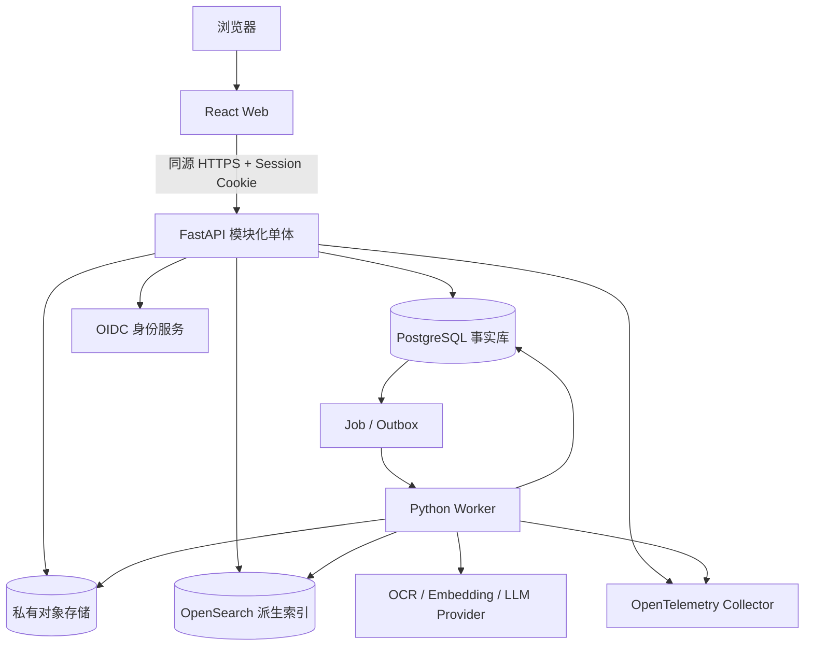
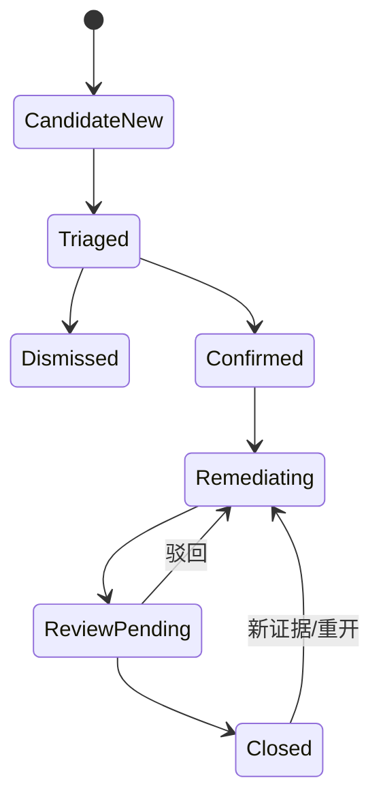

# 环保托管运营平台：一期技术蓝图

版本：v0.4 技术设计稿（已加入 Fixture-First 冷启动阶段）  
日期：2026-08-04  
状态：`TECH_DESIGN_DRAFT - Local Fixture 已锁定，待真实试点约束与 Acceptance Gold`  
对应产品范围：`环保托管运营平台_产品定义与一期范围_2026-08-04.md`

> 本文回答“一期各项技术怎么实现、失败怎么处理、怎么验收”。它是开发蓝图，不代表系统已经建成，也不替代安全测评、法律意见和环保专家结论。

## 1. 技术结论

一期采用：

> **React 网页端 + FastAPI 模块化单体 + PostgreSQL 唯一事实源 + S3 类对象存储 + 一个可靠 Python Worker + 可重建的 OpenSearch 搜索层。**

核心判断：

1. 一期不拆微服务，不上 Kubernetes、Kafka、Temporal、独立向量数据库或知识图谱。
2. `enterprise_id` 是安全租户边界，`facility_id` 是企业内子范围；前端选择企业不等于获得权限。
3. 原件不可覆盖；正式对象保存实际 `object_version_id + SHA-256`，由 Worker 对上传字节重新计算哈希。已发布 PDF 也是不可变 artifact，重新渲染只能创建新版本。
4. AI 只生成候选、解释和草稿；正式发现、适用规则、关闭结论和报告签发必须经过有权限的人确认。
5. 业务时间线、审计日志、合规日历和技术 outbox 分开建模。
6. 报告冻结的是 canonical JSON 内容快照和来源版本，PDF 只是可重新渲染的交付物。
7. 搜索质量是产品核心，因此一期保留 OpenSearch；试点阶段每家企业独立索引，公共法规和内部方法另建索引，降低串库风险。
8. 所有异步处理按“至少执行一次”设计，通过幂等键、heartbeat、租约 generation/fencing token 和资源版本抵御重复执行与旧 Worker 回写。
9. PDF、Office、图片和报告 HTML 都是不可信输入；解析和渲染在无外网、无长期凭据、有资源上限的沙箱子进程/容器中运行。

### 1.1 与旧黑客松 Demo 的接管关系

旧 Demo 的定位保持为 `VERIFIED_HACKATHON_PROTOTYPE`，不在其固定数据和前端状态上继续堆生产功能：

| 处理 | 内容 |
|---|---|
| 复用 | 视觉语言、信息层级、企业库/政策库区分、报告表达和演示叙事 |
| 重做 | 身份权限、真实上传、对象存储、解析/OCR、证据定位、规则、整改闭环、报告冻结、审计、测试和部署 |
| 禁止迁移为事实 | 固定 `60/100`、固定风险/整改建议、只增加文件数的上传、AI 失败后的模板答案、静态 PDF |

实施上新建正式应用骨架和数据库迁移；可逐页参考旧 UI，但任何页面只有接入真实 API、权限、状态和失败语义后才算迁移完成。旧 Demo 继续作为只读视觉参考，不直接作为生产 frontend 分支。[项目接管基线](./项目接管基线_2026-08-04.md)

旧 Demo 中的原始企业资料另行接管为 `LOCAL_FIXTURE`：核心包 24 个文件、20 个 PDF/213 页，覆盖纯扫描批复、原生文本、重复检测报告、长文档、DOC/DOCX/JPG。它可用于本地工程验证，但不是业务事实或 Gold；clean checkout 的统一说明见[本地 Fixture 使用边界](./LOCAL_FIXTURE_BOUNDARY.md)。

### 1.2 交付等级与不可降级项

一期终点尚待确认，但这只决定功能开放范围、可用性和运维增强，不改变真实企业资料的安全不变量：

| 交付等级 | 数据边界 | 可开放能力 |
|---|---|---|
| LOCAL_DEMO | 仅合成数据 | 视觉和流程演示；不得作为客户 UAT/生产证据 |
| LOCAL_FIXTURE_EVAL | 已登记的旧 Demo 资料，只限本机/隔离环境 | 验证上传、解析、OCR、检索、引用、权限、恢复和报告链路；结果必须标记 `FIXTURE_ONLY`，不得外推准确率或专业结论 |
| CONTROLLED_UAT | 经授权的真实/脱敏资料 | 租户隔离、原件版本/hash、基础审计、人工复核和可恢复性必须存在；高敏/批量导出、伙伴登录和外部通知可默认关闭 |
| LIMITED_PRODUCTION | 合同范围内的生产资料 | 在 UAT 基线上增加正式 SLA、告警/Runbook、定期恢复演练、高风险审批和运营治理 |

做不到安全控制的高风险能力应关闭，不能以“内部使用”为由保留无审计临时入口。当前 3–5 家试点继续采用同一 OpenSearch 集群内的每企业逻辑索引；routing 是分片定位机制而不是租户授权，共享索引还会增加 Get/Mget/Bulk/聚合等路径的隔离复杂度，不是更轻的一期方案。[T28]

## 2. 总体架构



部署单元只有四个业务组件：

- `web`：React 静态资源。
- `api`：身份会话、权限、业务命令、查询和签名 URL。
- `worker`：文件安全检查、解析/OCR、索引、日历、通知、报告和导出。
- `postgres`：业务事实、权限、审计、job 和 outbox。

对象存储、搜索、OIDC 和监控优先采用托管服务；如果必须私有化，再逐项替换。搜索索引可以清空后从 PostgreSQL 与对象存储重建，因此不是事实源。

## 3. 一期推荐技术栈

| 层 | 推荐 | 选择理由与边界 |
|---|---|---|
| Web | React + TypeScript + Vite + React Router + TanStack Query + React Hook Form/Zod | 延续旧 Demo；由客户端管理服务端数据缓存，并与表单、路由职责分开 |
| API | Python FastAPI + Pydantic + SQLAlchemy + Alembic | OCR/文档/AI 生态集中在 Python；OpenAPI 契约可自动生成 |
| 身份 | 标准 OIDC Provider + BFF 服务端 Session | 不自研密码、MFA、找回；浏览器不保存长期 access token |
| 数据库 | PostgreSQL 18 | 事务、RLS、版本、状态机、审计、job/outbox 统一管理 |
| 文件 | 私有 S3 类对象存储 | 原件、页图、解析 JSON、派生 PDF 和报告分别版本化 |
| 文件安全 | libmagic/MIME 校验 + 本地 ClamAV 作为首个恶意软件扫描 baseline + 结构/资源限制 | AV 只是其中一层；宏、压缩率、页数、密码和解析沙箱仍独立控制，具体引擎/版本需在阶段 0 锁定 |
| OCR/版面 | PaddleOCR 3.x + PP-StructureV3 作为本地基线 | 中文、方向、版面、表格和印章区域均有现成模块；具体模型必须用 Gold 选定并锁版本 [T5] |
| PDF | `pypdfium2` 渲染 + `pdfplumber/pdfminer.six` 坐标抽取 | 许可相对宽松；若选择 PyMuPDF，必须先解决 AGPL/商业许可 [T15] |
| Office | `python-docx` / `python-pptx` / `openpyxl` 原生抽取 + LibreOffice 派生 PDF | 原生结构用于字段和证据；PDF 用于稳定预览 |
| 搜索 | OpenSearch 3.x，试点单节点或托管单域 | BM25、向量、共同过滤和混合查询；不再加独立向量库 [T3][T4] |
| Embedding | 中文/多语模型做离线 bake-off，BGE-M3 仅作为首个 baseline | 型号不是产品契约，必须依据真实 Gold 决定 |
| 重排 | 默认关闭；Gold 证明有增益后启用 cross-encoder | 避免无证据增加延迟和成本 |
| 报告 | 版本化 HTML/CSS 模板 + 固定 Chromium/Playwright 渲染 PDF | 网页预览和 PDF 共用内容模型 [T10] |
| 可观测性 | OpenTelemetry SDK + Collector | API、Worker、OCR、搜索和报告共用 trace ID [T11] |
| 测试 | pytest + 真实 PostgreSQL 集成测试 + Playwright E2E + Gold 回归 | 不使用 SQLite 假装验证 RLS/事务语义 |

### 3.1 暂不固定的供应商

以下决策必须在确认部署地点、数据出境要求和预算后完成：

- OIDC/IDaaS 供应商。
- 对象存储供应商。
- 是否允许一家境内云 OCR 参与 Gold 对比。
- 恶意文件扫描引擎、签名更新/离线回滚 SLA，以及是否需要商业引擎或 CDR；默认从本地 ClamAV baseline 起步，不把原件交给未批准的云扫描服务。
- LLM 与 embedding 的部署位置。
- 邮件、短信和小程序通道。

代码只保留少量内部接口：`BlobStore`、`FileSafetyScanner`、`OcrLayoutEngine`、`Embedder`、`SearchBackend`、`AnswerGenerator`、`NotificationChannel`。不开发通用插件市场。

### 3.2 外部处理策略

每家企业都有独立的 `external_processing_policy`，默认 `DENY`。任何云 OCR、embedding、LLM、邮件或短信通道启用前，必须明确：处理目的、允许的数据类别与字段、供应商/子处理者、处理地域、传输路径、保存期限、删除证明、合同依据和批准人。调用时按“企业策略 + 资料密级 + 操作目的”实时判定，不能靠全局开关。

- 能在本地完成的格式识别、脱敏和规则计算优先本地完成；外发只给完成目的所需的最少片段。
- 许可证、监测记录、联系人、签章和坐标等字段按企业政策单独控制，不能把完整资料默认发给模型。
- Provider adapter 写入 `processing_disclosure`：实际发送字段、供应商、区域、模型版本、时间、结果和删除/留存状态。
- 策略撤销后停止新调用并取消未发送任务；已发送内容按合同和留存规则处理，不能声称“立即从第三方全部删除”。
- 数据出境、个人信息、重要数据和委托处理边界必须在试点前由业务方与专业法律/安全人员按最新适用规则确认；本文不作法律结论。[T19][T20][T21]

## 4. 模块边界

FastAPI 仍是一个部署单体，但代码按业务模块组织：

| 模块 | 负责 | 不负责 |
|---|---|---|
| `identity` | Session、邀请、MFA 状态、用户同步 | 自研密码认证 |
| `authorization` | RBAC、企业/厂区范围、伙伴分配、临时提权 | 只靠前端隐藏菜单 |
| `organizations` | 服务商、企业、厂区、人员关系 | 服务合同状态 |
| `engagements` | 每期服务范围、授权、开始/终止、负责人 | 企业主体本身 |
| `documents` | 上传、版本、分类、解析、人工复核、分享 | 正式环保结论 |
| `regulations` | 官方来源清单、采集、复核、发布、地区/行业、时间效力、版本关系和企业影响评估 | 全国自动爬取、无专家确认的适用判定 |
| `compliance` | 义务、候选发现、正式发现、证据、整改与复核 | CRM 商机状态 |
| `calendar` | 义务版本、日期实例、提醒规则 | 审计日志 |
| `reports` | 内容快照、复核、冻结、渲染、发布与作废 | 修改原始证据 |
| `portal` | 企业可见 DTO、补件、反馈、知悉 | 服务商内部备注与未复核 AI 候选 |
| `crm` | 人工转化的最小商机、跟进和结果 | 读取全部原件、改变专业严重度 |
| `audit` | 只增不改的审计事件 | 业务时间线文案 |
| `operations` | job、outbox、通知、用量、故障和重试 | 业务事实最终状态 |

## 5. 核心数据模型与不变量

### 5.1 租户与服务关系

```text
service_provider_org
  -> enterprise              企业是安全租户
      -> facility            厂区是子范围
      -> service_engagement  每一期服务合同/授权
```

企业主体和服务周期必须分表。企业可能续签、暂停、扩大范围或更换负责人，不能靠修改同一行覆盖历史。

数据库维护一份强制的 `tenant-scoped table manifest`。每张新表必须声明为 `TENANT_SCOPED`，或进入经安全审查的全局表白名单；未声明时迁移 CI 直接失败。

所有企业资源表：

- `enterprise_id NOT NULL`。
- 有厂区范围时 `facility_id` 同时存在。
- 跨表关联强制使用 `(enterprise_id, resource_id)` 复合外键或等价数据库约束，防止把 A 企业任务挂到 B 企业文件。
- 共享法规、内部方法使用独立表/Schema，禁止用 `enterprise_id IS NULL` 混在企业数据里。
- 平台登录、公共法规和全局审计使用明确的 `scope_type/scope_id`，不能用可空企业字段含糊表达作用域。

### 5.2 核心表组

| 领域 | 主要表 |
|---|---|
| 身份权限 | `user_account`、`server_session`、`enterprise_membership`、`facility_grant`、`role_permission`、`partner_assignment`、`temporary_elevation`、`external_processing_policy` |
| 服务关系 | `enterprise`、`facility`、`service_engagement`、`staff_assignment` |
| 文档 | `document`、`document_version`、`object_blob`、`file_security_scan`、`processing_run`、`document_page`、`layout_block`、`table_cell`、`extracted_field`、`field_review`、`portal_document_grant` |
| 法规 | `regulation_source`、`regulation_instrument`、`regulation_version`、`regulation_relation`、`regulation_review`、`obligation_regulation_dependency`、`regulation_impact_assessment` |
| 合规 | `obligation`、`obligation_version`、`finding_candidate`、`finding`、`finding_evidence`、`remediation_task`、`task_evidence`、`finding_review` |
| 搜索 | `search_index_build`、`retrieval_run`、`retrieval_citation` |
| 时间 | `calendar_occurrence`、`business_timeline_event`、`outbox_event` |
| 安全审计 | `audit_event`、独立 durable `security_event` sink、`audit_manifest` |
| 报告 | `report`、`report_revision`、`report_source`、`report_approval`、`report_artifact` |
| 经营 | `service_opportunity`、`opportunity_activity` |
| 运行 | `job`、`notification`、`notification_delivery`、`export_artifact`、`idempotency_record`、`usage_event`、`processing_disclosure` |

核心事实使用关系字段；OCR 引擎原始输出和低频扩展字段可使用带 `schema_version` 的 JSONB，但不能把企业、许可证、期限、发现项和状态全部塞进 JSON。

### 5.3 四类“时间数据”

| 类型 | 用途 | 修改方式 |
|---|---|---|
| `calendar_occurrence` | 未来要做什么 | 状态推进；义务变更产生新版本 |
| `business_timeline_event` | 顾问/企业可读的历史摘要 | 纠错时新增 superseding 事件 |
| `audit_event` | 谁在何时对什么做了什么 | 只追加，应用无 UPDATE/DELETE 权限 |
| `outbox_event` | 可靠触发索引、通知、报告等技术副作用 | 消费后标记，不面向客户 |

不要建立一张万能 `event` 表，否则客户展示、追责、提醒和重试会互相污染。

## 6. 登录、权限和租户隔离

### 6.1 登录

```text
浏览器 -> OIDC Authorization Code + PKCE -> API/BFF
       -> PostgreSQL server_session -> __Host-session Cookie
```

- 邀请制开户，不开放匿名注册。
- token、refresh token 和权限列表不进 `localStorage`。
- Cookie 固定 `Path=/; Secure; HttpOnly; SameSite=Lax/Strict`，不设置 `Domain`；两个 API 副本共享 PostgreSQL Session，不能使用进程内 Session。
- 所有 `POST/PUT/PATCH/DELETE` 同时校验 CSRF token 与 `Origin`；CORS 不允许宽泛 credentials。
- 登录、MFA、租户切换和临时提权后轮换 Session ID；定义空闲超时和绝对超时。
- 内部管理员、合作伙伴强制 MFA；企业负责人建议强制。
- 下载原件、批量导出、权限变更、报告签发和临时提权做 MFA step-up，并校验 OIDC `acr/amr/auth_time`，不能只信本地布尔值。
- 人员撤权时同时吊销 Session，不能等待长期 JWT 自动过期。[T6]
- 登出、撤权和企业切换时清空前端 Query Cache；敏感响应使用 `Cache-Control: private, no-store`。

### 6.2 RBAC + ABAC

- RBAC 回答“能做什么”：`document.preview`、`finding.approve`、`report.publish` 等。
- ABAC 回答“能对什么做”：企业、厂区、资料级别、服务期、伙伴分配、操作目的、MFA 状态。
- 服务端返回 `allowed_actions` 供前端展示按钮，但后端每个命令仍重新鉴权。
- 合作伙伴默认只有被分配企业的摘要权限，无全局搜索、原件下载和批量导出。

### 6.3 PostgreSQL RLS

每个请求在事务内通过参数化 `set_config(..., true)` 设置 `actor_id`、请求 ID 和操作目的。核心表同时执行：

```sql
ALTER TABLE documents ENABLE ROW LEVEL SECURITY;
ALTER TABLE documents FORCE ROW LEVEL SECURITY;
```

约束：

- 迁移 owner 与应用 runtime 账号分离。
- runtime 不是表所有者、超级用户，也没有 `BYPASSRLS`、DDL 或 `TRUNCATE` 权限。
- 租户边界用 restrictive policy；同时必须存在明确的 permissive allow policy，否则 restrictive policy 会全部拒绝。SELECT/INSERT/UPDATE/DELETE 分开定义，并包含 `WITH CHECK`。
- CI 按 manifest 检查租户表具有 `enterprise_id NOT NULL + ENABLE RLS + FORCE RLS + 复合外键`；忘记添加企业字段也必须失败。
- PostgreSQL 无匹配策略时默认拒绝，但表 owner、superuser 和 `BYPASSRLS` 可绕过；默认 permissive policy 还会以 `OR` 合并，所以必须测试策略组合。[T1]
- `job_dispatcher` 只能领取 job 元数据；领取后通过 `job_id + lease_token` 的受控函数建立企业上下文。`worker_runtime` 无租约时不能读取任何企业正文，也不能自行设置任意企业 ID。

### 6.4 存储、搜索和 Worker 重复校验

RLS 不是唯一防线：


- 对象键由服务端生成，签名下载前重新校验权限。
- 搜索由服务端选择明确的企业索引，不接受浏览器传来的索引名或 `X-Tenant-ID`。
- 固定顺序为：OpenSearch 只返回候选 ID -> PostgreSQL 批量校验企业/厂区/密级/版本 -> 只读取已授权正文 -> 生成 citation -> 才能进入缓存、LLM 或 API 响应。
- 一期不部署 Redis 或应用层服务端正文/搜索结果缓存；浏览器 TanStack Query cache 在撤权、登出和切换企业时清空。未来若引入服务端缓存，key 与失效条件必须包含企业、厂区、权限版本和资源版本，并且只能缓存 PostgreSQL 已重新授权的结果。
- Worker job 只携带引用，不携带正文、OCR 全文或供应商密钥；Worker 重新加载资源并验证企业，不能信任 job payload。
- 导出创建时和交付前分别检查权限；中途撤权则不交付。
- 匿名公开分享一期禁用；企业资料只能通过登录门户和显式 `portal_document_grant` 访问。

### 6.5 临时提权

技术管理员默认看不到企业正文。break-glass 流程要求：理由、工单、企业/厂区、允许动作、MFA、最长 30–60 分钟、默认只读、到期自动撤销、全量审计。批量导出、高敏原件、跨企业、写权限以及权限/审计配置修改必须双人批准；普通只读排障才可按风险单人批准。

## 7. 文件上传与对象存储

### 7.1 上传协议

```text
POST /v1/upload-sessions
 -> 返回随机 quarantine key + 5–10 分钟签名地址
浏览器直传
POST /v1/upload-sessions/{id}/complete
 -> 原子固定 object versionId / checksum / size / ETag
 -> 登记 document_version，异步完成安全检查和正式入库
```

对象路径示例：

```text
quarantine/{enterprise_uuid}/{upload_uuid}
tenants/{enterprise_uuid}/documents/{document_uuid}/{version_uuid}/original
tenants/{enterprise_uuid}/derived/{document_uuid}/{version_uuid}/...
```

控制点：

- 允许格式白名单，真实 MIME 与扩展名双检。
- `complete` 只能把上传会话从 `PENDING -> COMPLETED` 一次；处理链固定读取当时的 `object versionId`，旧 URL 后续写入不能改变已登记输入。
- 浏览器 checksum 只作传输校验；Worker 必须对实际对象字节重新计算 SHA-256，并保存大小、上传人、来源和时间。
- 隔离区完成恶意文件、压缩炸弹、宏、损坏和密码检查后，才复制到正式不可覆盖 key。
- 正式复制协议为 `copy -> HEAD/版本/哈希校验 -> 数据库标记 STORED`；重试使用确定性 key 和 upsert，不重复建立文档版本。
- Bucket 完全私有，客户端不能指定最终 key。
- quarantine 凭据无正式区写权限；runtime 账号禁止覆盖或删除正式区对象。
- 不跨企业提示“相同哈希已存在”，避免文件存在性泄漏。
- 开启版本控制、静态加密和 TLS；签名 URL 短时有效。
- 预签名 URL 可能在有效期内重复写同一 key，因此必须“一版本一个随机 key”。[T7]
- 文件上传要按 OWASP 要求同时做类型、名称、大小、隔离和恶意内容控制。[T8]
- 定时 reconciliation job 检测并处理孤儿对象、悬空数据库引用和缺失派生物。

### 7.2 原件与派生物

原件一旦入正式区不可覆盖，数据库保存 `object_version_id + SHA-256`。以下均为派生物：

- 规范化 PDF。
- 每页渲染图。
- OCR/版面原始 JSON。
- canonical document JSON。
- 缩略图、chunk、embedding、索引记录。
- 报告 PDF；每个已发布 PDF 作为独立不可变 `report_artifact` 保存对象版本与哈希，重渲染只能创建新 artifact。

删除或退租必须传播到全部派生层、缓存和临时转换目录；实际删除、归档或继续留存由文件类别、法规和合同决定。

只有合同、法规或证据保全明确要求 WORM 时，才对指定原件/报告启用 Object Lock；普通 Versioning 不能代替应用层不可覆盖约束。

### 7.3 导出

批量或高敏导出建立 `export_artifact`：企业、申请人、授权范围快照、资源版本、批准人、对象版本、到期时间和状态。创建时和交付前分别鉴权；高敏导出要求 MFA 与双人批准，下载 URL 不超过 60 秒，不作为邮件附件，临时工件在 24 小时或合同期限后自动删除。

## 8. 文档解析、OCR 和人工复核

### 8.1 统一流水线

```text
UPLOADED
 -> QUARANTINED
 -> VALIDATED
 -> NATIVE_EXTRACTING
 -> PAGE_ROUTING
 -> OCR_IF_NEEDED
 -> NORMALIZING
 -> FIELD_EXTRACTING
 -> REVIEW_REQUIRED | INDEXING
 -> READY
```

技术异常：`FAILED_RETRYABLE`、`FAILED_TERMINAL`、`UNSUPPORTED`、`MALWARE_QUARANTINED`。  
业务质量异常：`REUPLOAD_REQUIRED`、`REVIEW_REQUIRED`。低清和字段冲突不是“系统崩溃”。

`document_version.lifecycle_status` 只显示 `PROCESSING / REVIEW_REQUIRED / READY / FAILED / REJECTED`；具体技术步骤放进不可覆盖历史的 `processing_run.stage/status`。重跑新建 processing run，不重置旧记录；“字段待复核但允许内部搜索”使用独立可见性标记，不能冒充完全 READY。

### 8.2 各格式处理

| 格式 | 处理 | 稳定证据位置 |
|---|---|---|
| 原生 PDF | 抽文字和 bbox；仅低质量页 OCR | 原件版本 + 页码 + bbox |
| 扫描 PDF | 逐页 250–300 DPI、方向/纠偏、OCR、版面/表格 | 原件版本 + 页码 + bbox |
| 图片 | 保留原图与纠正图；OCR | 图片版本 + bbox |
| DOCX/PPTX | 原生结构抽取，同时 LibreOffice 转 PDF | 原结构路径 + 派生 PDF 页码 |
| XLSX | sheet、cell、公式和上传时显示值分别保存 | `sheet + cell range`；页码仅预览 |
| 旧 Office | 隔离容器内转换 | 原件 + 派生文件 |
| 密码文件 | 不破解 | 要求解密后重传 |
| ZIP/RAR | 一期不支持 | 避免来源关系和解压炸弹复杂度 |

PDF 不能只看“有没有文字层”；隐藏 OCR 层可能乱码。每页需要判断字符数、乱码率、文字覆盖率、图片面积、旋转、模糊和阅读顺序，再决定使用原生文本还是 OCR。

### 8.2.1 统一解析沙箱

PDF、Office、图片、LibreOffice 和报告 Chromium 全部在隔离子进程或沙箱容器中运行，而不是只隔离旧 Office：

- 默认无外网、无数据库/搜索/Secret Manager 长期凭据。
- 编排进程使用自身受限凭据读取固定 `object_version_id`、重新校验 hash，再把字节注入 run-scoped 临时目录；沙箱只看到只读 bind mount/管道和限定输出目录。
- 只读基础文件系统、独立临时目录，并限制 CPU、内存、页数、进程数、磁盘和执行时间。
- 禁止宏、PDF/Office 脚本、远程字体和外部资源。
- 报告 HTML 默认转义，Chromium 渲染禁止网络请求，防止恶意 `` 外传数据。

沙箱内不持有预签名 URL、对象存储地址、数据库/搜索凭据或 provider key，也不自行下载输入。编排进程回收结构化结果和派生文件、验证资源上限与 hash 后再持久化，并清理临时目录。

这仍是一个 Worker 部署单元，不要求拆成微服务；编排进程负责 I/O 和鉴权，沙箱只负责不可信文件的计算。

### 8.3 CanonicalDocument

业务层不依赖某家 OCR JSON，而统一为：

```text
document_version
  -> page
      -> layout_block(text/title/list/image/table/seal...)
      -> table -> table_cell
      -> extracted_field
  -> chunk
```

每个块必须带：企业、文件版本、证据 artifact/render hash、页码、页码基准、MediaBox/CropBox、页宽高、rotation、`coordinate_space_version`、归一化 bbox、阅读顺序、原文、置信度、引擎/模型版本和人工复核状态。DOCX/PPTX 页码必须绑定具体派生 PDF artifact。

Canonical 原文永不因安全清洗而修改。另生成 sanitized model view，并保存原文到清洗文本的 offset mapping；零宽字符、隐藏文字和异常指令只标记风险，不能破坏 citation offset。

### 8.4 分类与字段

一期只做 8–12 类高频资料，每类有独立字段 profile。流程为：

```text
用户选择/文件名规则 -> 模型候选 -> 格式与交叉校验 -> 人工复核
```

许可证号、统一社会信用代码、日期、污染物、排放限值、实测值、单位和签章属于高风险字段。进入正式报告前人工确认覆盖率必须为 100%。模型置信度只负责分流，不能等同于准确率。

### 8.5 许可风险

PyMuPDF 官方采用 AGPL 或商业许可；闭源商业项目不能在未作许可决策时直接打包。[T15] 一期默认从宽松许可的 renderer/extractor 组合起步，并用 Gold 比较坐标、表格和性能差异。

开工前生成 SBOM，并逐项核对 PDFium、LibreOffice、Chromium、中文字体、PaddlePaddle、OCR 权重、embedding/reranker 权重的商业使用和再分发条件；字体和模型权重许可不能被普通 Python 包许可证清单掩盖。

## 9. 规则、法规适用与专业结论

不能用自由问答代替规则计算。建议分三层：

1. **候选抽取**：OCR/LLM 从证据中提出字段或潜在矛盾。
2. **确定性规则**：类型、日期、编号、数值、单位、期限和跨文档一致性由版本化 Python rule 执行。
3. **专家判断**：法规适用性、严重度、例外条件和最终结论由有权限人员确认。

一期不开发可视化通用规则引擎。每条 rule function 都有：

```text
rule_id / rule_version / input_schema / source_versions
result = PASS | FAIL | UNKNOWN | REVIEW_REQUIRED
input_values / normalized_units / evidence_ids / executed_at
```

法规记录包含发布日、施行日、失效日、替代关系、地区、行业和专家确认状态。检索与规则执行都接受 `as_of_date`；新法规版本只重算未来义务，不改写历史结论。

### 9.1 法规内容运营边界

法规库不是“抓下来就可用于合规判断”的普通文档库。一期只维护：

- 国家层面与首个主行业直接相关的法律、行政法规、生态环境部规章/规范性文件和标准。
- 首个试点省、市的官方法规与生态环境主管部门正式文件。
- 3–5 家试点企业已有义务、许可证或报告实际引用的依据。

来源必须进入 `regulation_source` 白名单，记录官方机构、域名/入口、来源种类、辖区、负责人、监测方法和频率。优先使用国家法律法规数据库、生态环境部法规标准入口及首个试点地区的政府/生态环境主管部门官网；一期不爬全国所有地方站，也不自动判断全国企业适用性。[T26][T27]

每个版本至少保存：

```text
official_url / issuing_authority / document_no / jurisdiction
document_kind / publication_date / effective_date / repeal_date
captured_at / source_sha256 / workflow_status / temporal_status
content_rights / reviewer / approved_at
```

标准或第三方资料还要记录 `content_rights = FULLTEXT_ALLOWED | LICENSED | METADATA_AND_LINK_ONLY`；没有合法全文使用依据时只保存元数据、官方链接和必要引用，不把整份文本复制进检索库。

### 9.2 三个独立状态机

内容工作流：

```text
DETECTED -> SOURCE_VERIFIED -> STRUCTURED -> REVIEW_PENDING
         -> CHANGES_REQUESTED -> STRUCTURED
         -> APPROVED -> PUBLISHED

异常：SOURCE_INVALID | SOURCE_UNAVAILABLE | WITHDRAWN
```

法律时间状态：

```text
REFERENCE_ONLY: DRAFT_CONSULTATION
FORMAL:         NOT_YET_EFFECTIVE -> EFFECTIVE
                                    -> SUPERSEDED | REPEALED
无法确认：REVIEW_REQUIRED
```

企业影响评估：

```text
NOT_ASSESSED -> IMPACT_REVIEW -> NO_IMPACT
                              -> OBLIGATION_CHANGE_DRAFTED
                              -> EXPERT_APPROVED -> RECALC_QUEUED -> COMPLETED
异常：BLOCKED_MISSING_FACTS | REVIEW_REQUIRED
```

征求意见稿、草案和政策解读只能作为参考资料，不得触发企业义务重算。未取得正式废止依据，或上下位文件与法典关系尚未确认时，必须进入 `REVIEW_REQUIRED`，不能由关键词或 AI 批量标记为失效。

### 9.3 负责人和时效

| 角色 | 一期责任 |
|---|---|
| 法规内容负责人 | 维护来源清单、检查更新、录入正式来源与元数据 |
| 环保专业复核人 | 确认效力、条款关系、地区/行业适用边界 |
| 平台发布人 | 发布已批准版本，触发索引和影响评估 |
| 企业顾问 | 核实企业事实、许可证和存量义务是否受影响 |
| 系统运营 | 监控来源、索引、重算任务与异常队列 |
| 服务业务负责人 | 对内容时效 SLA 和未解决冲突负责 |

一期人员可以兼任，但导致正式企业义务变化时，录入人与专业复核人必须不同。以下是内部服务目标，不是法律规定：

- 试点来源清单每个工作日检查；已公布且 30 天内施行、立即施行或涉及废止的变更当日录入，1 个工作日内专业复核。
- 普通正式更新在 2 个工作日内录入与复核；每周做来源完整性对账，每月复核来源范围。
- 每个来源展示 `last_checked_at / last_success_at / last_change_detected_at`；连续失败超过 1 个工作日进入人工核查并显示新鲜度告警。
- 对已公布未施行版本提前 30、7、1 天提醒内容负责人和受影响顾问。

### 9.4 影响分析与重算硬规则

1. 只有 `APPROVED + PUBLISHED` 的正式版本才能触发影响评估。
2. 候选企业与义务由显式 `obligation_regulation_dependency`、地区、行业、厂区、许可证条件确定；向量相似度只能提供人工线索，不能批量改义务。
3. 重算创建新的 `obligation_version` 和候选日历，不覆盖旧版本。
4. 尚未开始且未冻结的未来事项，经专家批准后才能切换新版本。
5. `IN_PROGRESS / SUBMITTED / OVERDUE` 事项进入 `REVIEW_REQUIRED`，不能自动取消、改期或关闭。
6. `COMPLETED / CANCELLED / FROZEN` 事项和已批准报告保持不可变。
7. 默认从正式施行日起适用；追溯或过渡例外必须有正式文本证据和专家确认。
8. 新旧关系不清时保留已有事实，但阻止自动输出正式“适用/不适用”结论。
9. 历史查询与报告继续按原 `as_of_date + regulation_version_id` 重放。

《中华人民共和国生态环境法典》已于 2026-03-12 通过并将在 2026-08-15 施行；法典第 1242 条明确列出的 10 部法律同日废止。[T23][T24] 一期应预先把法典登记为 `NOT_YET_EFFECTIVE`，只映射试点义务实际引用的条款；8 月 15 日切换默认检索效力，同时保留 8 月 14 日及以前的历史视图。生态环境部正在逐项清理相关法规、规章和规范性文件，因此除明确的 10 部法律外，其他文件不得一次性标记为废止。[T25]

## 10. 混合检索与证据化问答

### 10.1 为什么不只用 PostgreSQL 搜索

PostgreSQL 单库能获得最简单的权限模型，但中文环保资料同时包含精确编号、专业术语、自然语言和复杂过滤。一期的核心价值就是搜索质量，因此采用 OpenSearch；PostgreSQL 仍是权限和版本的最终真相。

### 10.2 索引边界

试点阶段：

```text
enterprise_{opaque_uuid}_chunks_v1   每家企业独立
regulations_public_v1                公共法规
provider_internal_v1                 内部 SOP
```

- 服务商跨企业首页读取结构化摘要，不对所有企业原文做全局搜索。
- 普通搜索先要求用户明确进入一家企业。
- 客户门户永远不能搜索内部方法库。
- 历史版本与当前版本都可索引，但普通搜索默认只查当前版本。
- 索引通过 read/write alias 切换；每次构建记录 `index_schema_version + analyzer/dictionary_version + embedding_model_hash + search_pipeline_version`。
- 生产固定 OpenSearch 的精确 minor 版本、已安装插件、中文 analyzer/词典和 search pipeline；升级先重放 Gold，再建立新索引并原子切 alias，不能在原索引上静默改变分词或向量。

未来企业数量扩大后，再通过 Gold、安全测试和运维数据决定是否合并索引；一期不提前优化。

### 10.3 Chunk 与查询

- 按标题、条款、段落和表格语义切分；普通中文文本先从 300–800 字符起步。
- 法规不能拆断条/款/项；表格使用“重复表头 + 当前行”的检索文本，并保留 cell 链接。
- 精确编号、标准号、设备号、污染物和日期建 keyword/精确字段。
- 查询时对 BM25 与向量子查询应用同一套企业、厂区、语料域、当前版本、有效状态和密级过滤。[T3][T4]
- baseline 分别取 BM25 Top 50 与 dense Top 50；用 Gold 对比 OpenSearch normalization processor 与 score-ranker/RRF，再锁定一种 pipeline。混合查询本身不等于 RRF，所有权重、`rank_constant` 和候选窗口都属于版本化配置。[T17]
- cross-encoder 只可重排已经通过同一 ACL/filter 的候选；是否重排 Top 20 由 Gold 的质量、延迟和成本共同决定。
- 返回 8–10 个证据块，再由 PostgreSQL 二次校验权限和版本。

### 10.4 Citation 约束

检索服务为本次 `retrieval_run` 生成短期 `citation_id`，LLM 只能选择本次上下文中的 ID，不能自行编文件名和页码：

```json
{
  "citation_id": "C-8AF2",
  "document_version_id": "...",
  "document_sha256": "...",
  "page_no": 17,
  "bbox": [0.12, 0.34, 0.88, 0.46],
  "block_ids": ["b-32", "b-33"]
}
```

稳定事实不是 `C-8AF2`，而是其背后的 `document_version_id + block/cell + artifact/render hash`。Excel 引用使用 `sheet + cell_range`。前端通过 PDF.js 打开精确文件版本和页码，并按 bbox 高亮；后端再次检查 citation 是否属于当前 retrieval run、未过期且调用人仍有权限。

### 10.5 RAG 安全与回答状态

上传资料是不可信输入：

- 文档内容只当数据，不当系统指令。
- 问答模型不获得删除、发消息、改任务或访问文档 URL 的工具权限。
- 检测零宽字符、异常隐藏文字和可疑提示注入，并记录风险标记；模型只看 sanitized view，canonical evidence 保持原样，并通过 offset map 回到原证据。
- 输出必须通过 citation allowlist 校验。
- 每个可验证陈述必须映射到一个或多个 citation；引用不存在、越权或已过期时整段回答不能发布。
- RAG poisoning 和间接提示注入是明确攻击面。[T9]

答案状态必须可区分：

- `ANSWERED_WITH_EVIDENCE`
- `INSUFFICIENT_EVIDENCE`
- `CONFLICTING_EVIDENCE`
- `REVIEW_REQUIRED`
- `SERVICE_UNAVAILABLE`

远程模型失败时不能像旧 Demo 一样返回模板答案伪装成功；搜索仍可用，但生成式回答明确降级。

## 11. 业务状态机

### 11.1 服务周期

```text
DRAFT -> AUTH_PENDING -> COLLECTING -> BASELINE_REVIEW
      -> READY_FOR_SERVICE -> IN_SERVICE -> PAUSED
      -> OFFBOARDING -> ENDED
```

创建企业记录不代表“托管中”。进入 `IN_SERVICE` 前至少完成服务范围、数据授权、保密/留存、顾问、客户负责人、通知和最低资料基线。

### 11.2 发现—整改—复核



- AI 只创建 `finding_candidate`，默认不对企业门户可见。
- `finding_candidate` 与 `finding` 是两个 aggregate。人工执行 promote 命令时，在一个事务内新建 `finding`、写 `source_candidate_id`、将候选改为 `PROMOTED` 并写审计；`finding.source_candidate_id` 建唯一约束，防止双击或并发生成两条正式发现。
- 候选被驳回保留理由、模型/规则版本和原证据；后续模型重跑可以新建候选，但不能复活或覆盖旧候选。
- 企业提交材料是 `EVIDENCE_SUBMITTED`，不等于问题已关闭。
- 高优先级发现必须有整改证据和独立复核人。
- 客户“已知悉”与专家“已验证”分开记录。
- 严重度、适用性和关闭结论变更必须填写理由。
- `逾期`由期限动态计算，不写成业务状态。

任务状态：`TODO -> IN_PROGRESS -> SUBMITTED -> VERIFIED -> DONE`，被驳回则回到处理中。

### 11.3 合规日历

`obligation_version` 生成具体 `calendar_occurrence`。计划类型支持：

- 固定日期。
- RFC 5545 `RRULE` 周期。[T22]
- “某事件后 N 天”的相对规则。
- 人工计划。
- 工作日/节假日调整。

每个日期规则还必须保存 `timezone`、起算事件、起算日是否计入、自然日/工作日、节假日顺延方向、截止时刻和解释文本。中国试点默认 `Asia/Shanghai`，但不能把“后 N 天”写成一个没有口径的整数。

工作日计算使用经过业务确认的中国节假日/调休数据源，并保存 `calendar_source + calendar_version`；下一年度数据未发布或来源异常时，实例进入 `REVIEW_REQUIRED`，不能悄悄按周一至周五推算。法规、许可证、节假日或服务范围变化时生成新义务版本，只重算尚未冻结/完成的未来实例，过去完成记录保持不变。

### 11.4 CRM 人工转化

只有明确命令可以将人工确认的 finding 转成机会：

```http
POST /v1/findings/{id}/actions/convert-to-opportunity
```

商机只复制问题大类、严重度、服务缺口、期限和负责人，不复制原件、联系人隐私或内部专家讨论。销售不能改变 finding 严重度，系统不自动外呼或自动创建商机。

## 12. 报告冻结和发布

报告不能用一条状态同时表达“内容审完了没有、PDF 生成了没有、客户看到了没有”。采用三个正交状态轴：

```text
content_status:     DRAFT -> REVIEW_PENDING -> CHANGES_REQUESTED -> DRAFT
                             -> APPROVED_FROZEN -> SUPERSEDED | VOID
artifact_status:    NOT_REQUESTED -> QUEUED -> RENDERING -> READY | FAILED
publication_status: NOT_PUBLISHED -> READY_TO_PUBLISH -> PUBLISHED -> REVOKED
```

`approve-and-freeze` 在同一 PostgreSQL 事务中完成审批、canonical snapshot、来源清单、内容哈希、审计和 outbox。渲染失败只重试 artifact，不把已经批准的内容退回草稿；内容发生变化必须创建新 revision 并重新审批。

冻结事务保存：

- canonical report JSON。
- 所有 `document_version_id + page/bbox` 或 `sheet/cell`。
- finding、task、台账版本。
- 模板、规则、OCR、模型和渲染器版本。
- 复核人、冻结时间和理由。
- canonical JSON 的 SHA-256；可按 RFC 8785 规范化后计算。[T14]

Worker 渲染完成时保存 `report_artifact.object_version_id + SHA-256 + renderer_image_digest + template/font version`。发布命令再次检查内容、artifact、权限和 MFA，在同一事务写 publication、门户 grant、审计和通知 outbox；通知失败不能回滚已发布事实，但状态要可见并可重试。

冻结后禁止修改；修订只能新建 `report_revision`。固定 Chromium、字体和模板后做视觉回归。验收重点是内容哈希、来源和版面一致，不默认承诺 PDF 字节完全相同。作废/撤回只改变发布可见性并追加说明，不删除旧 artifact 或改写历史审计。

## 13. API 与前端实现

### 13.1 API 规则

- 查询使用稳定 cursor 分页。
- 重要状态转换使用 action endpoint，禁止前端直接 `PATCH status="closed"`。
- 创建、上传完成、promote、冻结、发布、转商机等接口要求 `Idempotency-Key`。唯一作用域为 `enterprise_id + actor_id + method/route + key`，同时保存 request body hash；同 key 不同 body 返回 `409 IDEMPOTENCY_KEY_REUSED`，不能把前一次结果错配给新命令。
- 可并发编辑对象返回 `ETag/version`；修改要求 `If-Match`，旧版本返回 `412`。[T12]
- 错误使用 RFC 9457 Problem Details，并增加业务 `code` 与 `correlation_id`。[T13]
- OCR、索引、报告等长任务返回 `202 + job_id`，前端短轮询；一期不需要 WebSocket。
- 正式确认、权限、报告冻结不做前端乐观假成功。
- 所有 `GET/HEAD` 无业务副作用；Cookie 会话下的写请求执行 CSRF token + Origin 校验。[T18]
- 登录、邀请、上传、搜索、问答、下载、导出和高风险命令按 IP、actor、企业和 endpoint 分层限流；触发限流写安全事件但不记录敏感正文。
- 统一设置 CSP、`frame-ancestors`、`X-Content-Type-Options: nosniff`、Referrer Policy 和 HSTS；敏感响应与错误均 `private, no-store`。

典型命令：

```http
POST /v1/findings/{id}/actions/submit-review
If-Match: "7"
Idempotency-Key: 8a...

{
  "evidence_ids": ["..."],
  "comment": "已提交整改证据，请复核"
}
```

### 13.2 前端页面

同一个 React 代码库使用两个 Shell：

- `/app/*`：服务商内部工作台。
- `/portal/*`：企业客户门户。

内部一期页面：企业列表、企业总览、资料中心、解析/字段复核、搜索与证据预览、发现项、任务、日历、报告、时间线、账号与分配、失败任务。  
企业门户：本企业总览、待补资料、已发布发现、自己的任务、日历、报告、反馈。

TanStack Query 只负责服务端数据缓存和失效；权限真相、状态机和业务校验留在服务端。移动端一期定位为查看、补件、确认和提醒，不承载复杂证据复核。

## 14. Worker、Outbox 和失败恢复

### 14.1 Job 表

```text
kind / enterprise_id / resource_id / input_version
queue_class / priority / idempotency_key / status / attempts / run_after
lease_owner / lease_until / lease_generation / heartbeat_at
progress_checkpoint / error_code / trace_id
```

Worker：

1. 使用 `FOR UPDATE SKIP LOCKED` 短事务领取任务；PostgreSQL 官方明确说明该方式适合多个消费者访问队列式表。[T2]
2. 领取时递增 `lease_generation` 并返回随机 lease token；写入租约后立即提交，在事务外执行 OCR、索引或渲染。
3. 长任务定期 heartbeat 续租；所有进度和最终写入都用 `job_id + lease_generation/token` 做 compare-and-set。旧 Worker 即使恢复，也不能覆盖新租约的结果。
4. 开始与提交前都核对 `input_version` 仍是目标版本；资源已被 supersede 时标记 `STALE_INPUT`，不发布旧 OCR、索引或报告。
5. 文档任务按页/批保存 checkpoint，重领后从最后完成页继续；中间结果使用 run-scoped key，只有最终 CAS 成功才能提升为 current artifact。
6. 临时错误指数退避并加入 jitter，默认最多 3 次；密码、恶意文件和不支持格式直接进入人工/终止队列。
7. Worker 崩溃后租约过期，其他实例重新领取。人工重跑创建新 attempt/run，不篡改旧失败记录。
8. 幂等键使用 `enterprise + resource version + stage + pipeline version`；数据库建唯一约束。
9. `interactive / document / report / notification / maintenance` 使用独立 queue class、并发上限和企业公平配额，避免大批 OCR 饿死报告发布或提醒。

### 14.2 Transactional Outbox

业务命令在同一数据库事务中只完成：

```text
修改业务状态 + 写审计 + 写业务时间线 + 写 outbox
```

outbox relay 用 event ID 幂等创建 job 或向外部通道投递，从而避免“整改保存了但通知没发”“报告冻结了但渲染任务丢失”。定时维护、人工重跑等没有对应业务状态变化的操作可以直接创建 job；同一个副作用只能选择 outbox 或 direct job 一条入口，不能同时写两份。

outbox 和 job 都按至少一次处理：`outbox_event.event_id`、`job.idempotency_key`、外部 provider request ID 分层去重。relay 崩溃在“已执行但未标记”之间时允许重复投递，但消费者必须返回同一业务结果。

### 14.3 跨系统提交协议

PostgreSQL 不能与对象存储、OpenSearch 做分布式事务，因此每个 job 使用显式的可恢复协议：

- 对象：写 run-scoped/确定性 key -> HEAD/版本/哈希验证 -> 事务内登记 artifact -> 原子切 current pointer。
- 搜索：按 `document_version + pipeline_version` upsert -> 回读数量/版本 -> PostgreSQL 标记 indexed；删除索引后可全量重放。
- 通知：先建立 delivery attempt 和 provider idempotency key -> 调用 -> 记录 provider 结果；超时进入 `UNKNOWN`，先查询/对账再决定重发。
- 定时 reconciliation 对账数据库事实、对象、索引和 provider 回执，异常进入运维列表而不是自动伪造成功。

### 14.4 故障语义

| 故障 | 用户看到 | 系统处理 |
|---|---|---|
| OCR 超时/OOM | 处理中失败，可重试 | 退避重试；超限后人工队列 |
| 文件损坏/密码 | 需要重传 | 不自动重试 |
| 低清/缺页/字段冲突 | 待复核/重扫 | 保留原件和候选，不标系统失败 |
| OpenSearch 不可用 | 搜索暂不可用；文件仍已保存 | 索引任务排队，恢复后补建 |
| LLM 不可用 | 生成式回答不可用 | 不返回模板成功；证据搜索可继续 |
| Worker 中途退出 | 仍在处理/稍后重试 | 租约过期后恢复 |
| 用户处理中被撤权 | 导出/结果不交付 | 交付前再次鉴权 |

## 15. 通知、审计和用量

### 15.1 通知

一期只做站内通知和邮件：提前 N 天、到期、逾期升级、待补件、待复核、报告发布。邮件只发摘要和登录链接，不附敏感原件。

`dedup_key = 事件 + 收件人 + 渠道 + 计划时间`，避免 Worker 重试重复发送。状态为 `PENDING / SENDING / SENT / FAILED / UNKNOWN / CANCELED`：provider 超时只能标 `UNKNOWN`，先查询回执或人工对账，不能立即重发造成重复通知。

真正发送前重新校验收件人仍有 membership、资料可见性和通知同意；人员撤权、服务结束、报告撤回或门户 grant 取消时，取消所有尚未发送的 delivery。通知 payload 只保存资源 ID 和最少模板变量，渲染时再按权限读取。短信、飞书、微信和小程序消息只保留通道接口，二期接入。

### 15.2 审计

审计事件包含：操作者、有效操作者、企业/厂区、动作、资源与版本、结果、理由、用途、request/trace ID、IP、权限策略版本、临时提权 ID、前后哈希。

- 登录、搜索、预览、下载、导出、上传、OCR 修改、专业复核、报告签发、权限变更、临时提权和失败越权均记录。
- runtime 只可调用 append-only 数据库函数，不能直接 UPDATE/DELETE 审计表；每天/每分区生成事件数量、首尾 ID 和哈希 manifest，并复制到独立只写存储，便于发现删改。哈希是侦测机制，不代替访问控制和备份。
- 失败鉴权不能跟随被回滚的业务事务一起消失：API middleware 在事务结束后向独立 `security_event` sink 写入脱敏元数据；审计 sink 暂时不可用时，高风险写命令 fail closed，普通读取告警并按经批准策略处置。
- 调试日志不保存密码、Session、token、完整 OCR、完整 prompt 或企业正文。
- 搜索词可能含敏感信息，默认记录哈希、类型和结果数；确需原词时单独加密并缩短留存。

### 15.3 成本计量

`usage_event` 至少记录：企业、文档版本、页数、OCR 引擎、CPU/GPU 秒、embedding token、LLM token、搜索次数、对象存储字节、报告页数和供应商费用。

这不是一期计费系统，而是回答：哪类文件最贵、是否值得上 GPU、云 OCR 是否划算、每家企业的真实服务成本是多少。每企业还要设置上传、并发和队列配额，防止一家企业堵塞全部 Worker。

## 16. 可观测性、备份和部署

### 16.1 监控

- API p50/p95/p99、5xx、连接池。
- job 最老等待时间、失败率、重试率和过期租约。
- OCR 页/分钟、人工复核率、索引延迟。
- 搜索延迟、无结果率、引用失败和 ACL 异常。
- 报告渲染、通知投递、对象容量和证书到期。
- API、Worker、OCR、搜索和报告共用 trace ID。

指标标签不放企业或用户 ID，避免高基数；这些 ID 只进入受控日志和审计。[T11]

### 16.2 备份

- PostgreSQL 基础备份 + WAL 连续归档，支持 PITR。[T16]
- 备份使用独立账号/项目和最小只写凭据，备份副本单独加密并与生产管理员权限隔离；对象存储启用版本控制并复制到符合地域约束的不同故障域。
- 搜索索引不备份业务真相，保留全量重建脚本；如果实测重建超过 RTO，再增加 OpenSearch snapshot，但 snapshot 仍不是事实源。
- 同时备份密钥引用、模板、规则版本和部署配置。
- 恢复演练必须包含实际密钥取回/解密、数据库 PITR、对象版本、权限/RLS、跨企业隔离、报告哈希和搜索重建。恢复环境默认暂停所有外发通知和 webhook，完成时间点与业务对账后才人工解除。
- 上线前完成完整恢复；以后至少每季度演练。备份任务“显示成功”不等于可恢复。

建议的试点目标，需由双方确认后成为 SLA：月可用性 99.5%；普通接口 p95 < 800ms；非生成式检索 p95 < 3s；RPO <= 15 分钟；RTO <= 4 小时。

### 16.3 部署

- 开发环境可容器化本地运行；生产与 staging 分离。
- `LOCAL_FIXTURE_EVAL` 使用独立本地数据库、对象前缀和搜索索引；网络调用默认 deny，记录不得迁移到普通 staging、UAT 或生产。
- 普通 staging 只使用合成数据；另设访问受控、留存更短的 evaluation/UAT 环境，只有取得明确授权时才放入真实/脱敏样本，不能把真实资料随意复制到日常测试环境。
- 数据库、搜索、Worker 管理面和对象存储管理面只走私网。浏览器只访问同源 HTTPS API 和被明确列入 CSP/CORS 的短期预签名对象 endpoint，不直接访问数据库、搜索或 bucket list API。
- API 可两副本；Worker 支持自动拉起和租约恢复。
- 优先托管 PostgreSQL、对象存储和搜索；一期不上 Kubernetes。
- Secret 进入 Secret Manager，不写 `.env` 交付包或代码仓库。
- 解析/渲染沙箱的网络策略默认 deny-all；只有编排进程按企业 external-processing policy 访问批准的 provider endpoint。
- 数据库迁移采用 expand/contract，部署前自动跑 manifest/RLS、契约、Gold smoke 和恢复兼容检查；每个版本保留应用与索引 alias 的回滚步骤。
- 单机合成数据演示只能标记 `LOCAL_DEMO`，不能作为客户 UAT 或生产验收证据。

## 17. Gold 与验收体系

### 17.1 Gold 建议规模

Gold 之前先有一层 `Fixture Evaluation`。当前环境 Demo 资料处于 `LOCAL_FIXTURE / UNLABELED`：它能验证工程链路和建立人工标注起点，但没有字段、表格、引用和专业结论真值，因此不能称为 Gold，也不能据此宣传准确率。

受控内部 UAT 开始前建立 Seed Gold：目标仍为 20–40 份文件、100–200 页、至少 100 个关键字段、30–50 个检索问题和 20 组越权/注入样例，用于开发回归，不对外宣传准确率。可先从 Fixture 中人工双标 10–15 页扫描件、2–3 份检测报告、20–30 个客观字段、15 个可回答问题和 5 个无答案问题，形成 `Seed Gold v0.1 Lite`；未经过环保专家裁决的风险/法规判断不能成为 Gold truth。

有限生产验收前扩展为 Acceptance Gold：

- 100–200 份代表性文件。
- 500–1,000 页 OCR/版面样本。
- 500–1,000 个关键字段。
- 150–300 个真实检索问题，其中至少 100 个是盲测可回答问题、至少 20% 明确无答案。
- 50 组越权、提示注入、隐藏文字与历史版本测试。

Gold 保存来源授权、文件版本/hash、标注指南、标注人和争议裁决。关键字段、表格和问答引用由两人独立标注后裁决。近重复文件必须在同一数据切分，至少 20% 文档版本作为盲测，防止“同一许可证复印件同时进入调参与测试”。

### 17.2 一期工程门槛

以下是起始建议，最终以真实样本校准：

Fixture 阶段可以用相同指标发现回归，但报告必须标记 `FIXTURE_ONLY / PIPELINE_REGRESSION_ONLY`；达到下表数字不等于客户 UAT、行业泛化或专业结论达标。

| 项目 | 门槛 |
|---|---:|
| 支持格式入库成功率 | >= 95% |
| 幂等重跑产生重复业务结果 | 0 |
| 清晰中文页字符错误率 CER | <= 3% |
| 困难扫描页 CER | <= 8%；超过则进入人工/重扫 |
| 资料分类 Macro-F1 | >= 0.90 |
| 关键字段人工前 exact match | >= 95% |
| 正式报告关键字段人工确认覆盖 | 100% |
| Recall@10 | >= 90% |
| Recall@20 | >= 95% |
| 精确编号 Top-5 命中 | >= 98% |
| 引用到正确文件版本与页码 | >= 95% |
| 回答中可验证陈述的证据支持率 | >= 98% |
| 无证据问题正确拒答率 | >= 90% |
| 跨企业泄漏 | 0 |
| 企业业务表 RLS 覆盖 | 100% |
| 高权限用户 MFA 覆盖 | 100% |
| 冻结报告来源版本与内容哈希可核验 | 100% |

所有指标报告分子、分母、样本分层、模型/pipeline 版本和 95% 置信区间；小样本不只报百分比。OCR 按原生、清晰扫描、困难扫描、表格/印章分层；字段同时报每字段和 macro/micro；检索按精确编号、自然问句、表格、历史版本和无答案分层。

“证据支持率”按回答中的可验证 claim 逐条判定，不能只检查有没有 citation；“人工确认覆盖 100%”只说明发布流程完整，不代表模型本身 100% 准确。OCR、分类、字段、表格、检索、引用、规则和专家结论分别统计，不能宣传一个笼统“AI 准确率 95%”。

### 17.3 必测场景

1. A 企业通过 URL、请求体、搜索词、下载链接、缓存或聚合无法获知 B 企业内容或存在性。
2. 没有租户上下文时数据库默认拒绝；应用账号不能关闭 RLS、TRUNCATE 或读全表。
3. 连接池交替执行 A/B 请求，无上下文残留。
4. CSRF、宽泛 CORS、会话固定、旧 MFA 和缓存残留均不能绕过授权。
5. 合作伙伴到期、人员撤权和临时提权到期在 1 分钟内生效；未发送通知和未交付导出同时取消。
6. Worker 在 OCR、索引和报告中途被杀，可恢复且不重复生成结果；旧 lease/fencing token 无法回写。
7. 输入版本在处理中被替换后，旧 Worker 结果不会成为 current；分页 checkpoint 恢复不丢页、不重建正式结果。
8. outbox relay 在投递前后分别被杀，副作用不丢且业务结果只出现一次。
9. 搜索索引全部删除后可在 RTO 内重建；旧 pipeline 不能与新 embedding/analyzer 混用。
10. AI 候选不会进入企业门户或正式报告；并发 promote 只生成一条正式 finding。
11. 高优先级 finding 没有证据和独立复核不能关闭。
12. 报告内容冻结后不能修改；渲染失败只重试 artifact；修订只能建新版本。
13. 未批准企业的资料不会被发送到任何外部 OCR/LLM；批准后披露记录与实际 payload 一致。
14. 至少完成一次实际密钥恢复、PITR、跨租户验证、退租删除和供应商故障演练；恢复期间不会误发旧通知。
15. `as_of_date=2026-08-14` 时法典显示未施行；`as_of_date=2026-08-15` 时法典生效，法典明确列出的 10 部法律显示废止。
16. 征求意见稿不会创建或修改企业义务；未确认的下位文件进入 `REVIEW_REQUIRED`，不会被批量标为废止。
17. 100% 活跃试点义务具有已批准依据版本，或明确处于 `REVIEW_REQUIRED`；法规更新不会修改历史完成事项和已发布报告。
18. 法规来源失败、未复核更新、适用冲突和重算失败在后台都有可见队列与审计。

## 18. 实施顺序与退出门槛

### 阶段 F0：Local Fixture 工程验证（现在即可开始）

- 冻结核心 24 份资料、两个受控负样本、SHA-256 manifest 与排除项；不复制 `.env.local`、代码、静态评分和预生成结论。
- 建立 `Fixture Enterprise A`，再用纯合成 canary 建立企业 B；Fixture 对象、数据库和索引使用独立命名空间且不可迁移到 UAT/生产。
- 先跑 10 项 smoke，再跑全包上传、MIME/安全入口、解析、OCR fallback、字段复核、检索、页码/坐标引用、报告快照、幂等和 Worker 恢复。
- 外部 OCR/LLM/embedding、通知、Webhook 和正文遥测全部关闭，并自动测试 `external_processing_policy=DENY` 确实阻断远程 provider。
- 从代表页开始制定标注指南；完成双人标注前始终保持 `benchmark_tier=NONE`。

退出：26 个入选/负样本哈希均可复核；支持和失败路径可重放；跨合成租户泄漏为 0；外部资料调用为 0；旧固定结论没有进入事实库；所有报告和截图均带 `FIXTURE_ONLY`。

阶段 1 的底座和阶段 2 的文档链路可以在 F0 中并行推进；0B 是真实客户 UAT、供应商冻结和专业结论的闸门，不是开始写工程骨架的前置条件。

### 阶段 0B：真实试点与验收基线

- 冻结首个地区/行业、3–5 家试点队列；先指定 1 家企业/1 个厂区作为纵向切片。
- 明确服务商管理员、顾问、专家复核人、企业负责人的实际人员、兼任边界和职责分离点。
- 取得书面资料及外部处理授权，收集代表真实分布的样本，建立独立的试点校准集和 Acceptance 盲测基线。
- 用真实授权样本比较本地 OCR 与获准云 OCR；Fixture 结果不能单独决定采购。
- 决定部署地点、数据出境、OIDC、对象存储和搜索供应商。
- 冻结试点法规来源清单、内容负责人、专业复核人和法典切换影响队列。

退出：统一决策台账相关 P0 已关闭，有真实流程/数据字典、书面授权、可复现 Gold、独立盲测集和一期验收终点。

### 阶段 1：平台底座

- OIDC/Session、企业/厂区、服务周期、RLS、对象存储、上传、job/outbox、审计。
- 先用 A/B 两租户自动测试所有基础路径。

退出：跨租户泄漏 0，上传原件可追溯，Worker 可重试。

### 阶段 2：文档智能

- 解析/OCR、CanonicalDocument、分类、字段复核、失败队列、PDF.js 证据预览。

Fixture 退出：固定夹具上的入库、关键字段和引用可回归，低质资料有明确人工路径。正式退出：真实试点校准后的 Gold 达标。

### 阶段 3：内部服务闭环

- 法规录入/复核/发布/影响评估，以及义务、finding candidate、正式发现、整改、复核、日历、业务时间线和通知。

Fixture 退出只能写“模拟闭环跑通”。正式退出仍要求一个真实项目从资料收集跑到整改关闭，且所有结论可展开到证据；法规变更能进入人工影响评估而不改写历史。

### 阶段 4：搜索与报告

- 分索引混合检索、证据化问答、报告 canonical 快照、冻结与发布。

Fixture 退出：检索/拒答/引用链路和报告冻结可回归。正式退出：真实 Gold 达标，报告来源和内容哈希可核验。

### 阶段 5：企业 UAT 与有限生产

- 企业门户、补件、反馈、已发布报告；备份恢复、告警、退租和事故 Runbook。
- 与原人工流程并行运行一个完整服务周期。

退出：客户 UAT、恢复演练和生产入口条件全部通过，再决定伙伴、小程序和扩行业。

## 19. 明确后置或拒绝的实现

- 微服务、Kafka、Temporal、Kubernetes。
- 通用低代码工作流和可视化规则编辑器。
- 在线多 OCR 投票和模型自动训练。
- 独立向量数据库、知识图谱、跨企业原文学习。
- 合作伙伴佣金结算和复杂渠道体系。
- 自动外呼、自动营销和自动创建商机。
- 自动政府申报、自动签章和无人复核的合规结论。
- 全国法规自动适用判定、IoT/在线监测、完整 EHS。
- 开放注册、大规模 SaaS、复杂计费和完整小程序。

## 20. 开工前仍需确认的技术输入

唯一更新入口为：[开工前决策与待确认事项](./开工前决策与待确认事项_2026-08-04.md)。

其中一期验收终点决定功能开放范围和运维增强，不决定租户 RLS、复合外键、原件版本/hash、基础审计和人工复核。P0 未关闭前可以用合成数据和已登记的 `LOCAL_FIXTURE` 搭模块化单体、迁移框架与内部回归；但 Fixture 不能进入 UAT/生产或外部 provider，也不能据此冻结供应商/专业 Schema、承诺客户准确率或生产 SLA。

## 21. 技术资料来源

- [T1] [PostgreSQL 18：Row Security Policies](https://www.postgresql.org/docs/current/ddl-rowsecurity.html)
- [T2] [PostgreSQL 18：SELECT / SKIP LOCKED](https://www.postgresql.org/docs/current/sql-select.html)
- [T3] [OpenSearch：Hybrid query](https://docs.opensearch.org/latest/query-dsl/compound/hybrid)
- [T4] [OpenSearch：Filtered k-NN](https://docs.opensearch.org/latest/vector-search/filter-search-knn/index/)
- [T5] [PaddleOCR：PP-StructureV3](https://www.paddleocr.ai/latest/en/version3.x/pipeline_usage/PP-StructureV3.html)
- [T6] [RFC 9700：OAuth 2.0 Security Best Current Practice](https://www.rfc-editor.org/rfc/rfc9700.html)
- [T7] [AWS S3：Using presigned URL](https://docs.aws.amazon.com/AmazonS3/latest/userguide/using-presigned-url.html)
- [T8] [OWASP：File Upload Cheat Sheet](https://cheatsheetseries.owasp.org/cheatsheets/File_Upload_Cheat_Sheet.html)
- [T9] [OWASP：RAG Security Cheat Sheet](https://cheatsheetseries.owasp.org/cheatsheets/RAG_Security_Cheat_Sheet.html)
- [T10] [Playwright：page.pdf](https://playwright.dev/docs/api/class-page#page-pdf)
- [T11] [OpenTelemetry：Signals](https://opentelemetry.io/docs/concepts/signals/)
- [T12] [RFC 9110：HTTP Conditional Requests](https://www.rfc-editor.org/rfc/rfc9110.html)
- [T13] [RFC 9457：Problem Details for HTTP APIs](https://www.rfc-editor.org/rfc/rfc9457.html)
- [T14] [RFC 8785：JSON Canonicalization Scheme](https://www.rfc-editor.org/rfc/rfc8785.html)
- [T15] [PyMuPDF：Licensing FAQ](https://pymupdf.readthedocs.io/en/latest/faq.html)
- [T16] [PostgreSQL：Continuous Archiving and PITR](https://www.postgresql.org/docs/current/continuous-archiving.html)
- [T17] [OpenSearch：Score ranker / RRF processor](https://docs.opensearch.org/latest/search-plugins/search-pipelines/score-ranker-processor/)
- [T18] [OWASP：Cross-Site Request Forgery Prevention](https://cheatsheetseries.owasp.org/cheatsheets/Cross-Site_Request_Forgery_Prevention_Cheat_Sheet.html)
- [T19] [中国人大网：中华人民共和国个人信息保护法](https://www.npc.gov.cn/WZWSREL25wYy9jMi9jMzA4MzQvMjAyMTA4L3QyMDIxMDgyMF8zMTMwODguaHRtbD9yZWY9aW1i)
- [T20] [国家法律法规数据库：中华人民共和国数据安全法](https://flk.npc.gov.cn/detail?fileId=&id=ff80818179f5e0800179f885c7e70392&title=%E4%B8%AD%E5%8D%8E%E4%BA%BA%E6%B0%91%E5%85%B1%E5%92%8C%E5%9B%BD%E6%95%B0%E6%8D%AE%E5%AE%89%E5%85%A8%E6%B3%95&type=)
- [T21] [国家网信办：促进和规范数据跨境流动规定](https://www.cac.gov.cn/2024-03/22/c_1712776612187994.htm)
- [T22] [RFC 5545：iCalendar](https://www.rfc-editor.org/rfc/rfc5545.html)
- [T23] [生态环境部：中华人民共和国生态环境法典全文](https://www.mee.gov.cn/ywgz/fgbz/fl/202603/t20260313_1146496.shtml)
- [T24] [中国人大网：生态环境法典立法专题](https://www.npc.gov.cn/npc/c1773/c1848/c21114/sthjfdlf/)
- [T25] [生态环境部：关于深入学习贯彻《中华人民共和国生态环境法典》的通知](https://www.mee.gov.cn/xxgk2018/xxgk/xxgk03/202604/t20260408_1148465.html)
- [T26] [生态环境部：法规标准入口](https://www.mee.gov.cn/ywgz/fgbz/)
- [T27] [国家法律法规数据库](https://flk.npc.gov.cn/)
- [T28] [OpenSearch：_routing metadata field](https://docs.opensearch.org/latest/field-types/metadata-fields/routing/)
