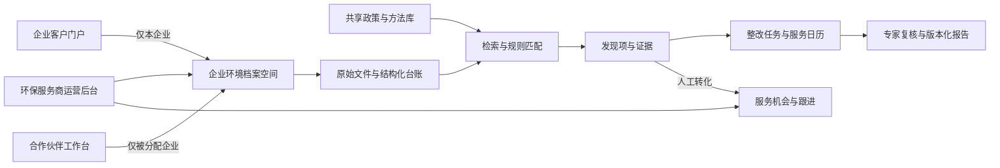

# 环保托管运营平台：产品定义与一期范围

版本：v0.4 研究与范围稿（已加入 Fixture-First 冷启动）  
日期：2026-08-04  
状态：`SCOPE_DRAFT - 待首个试点企业确认`  
适用对象：环保服务公司、受托企业、环保顾问/专家，后续可扩展至合作伙伴

> 本文将用户口述业务需求、旧黑客松 Demo 审计结果和截至 2026-08-04 的公开资料合并为一份开发基线。法规与数据合规部分用于产品设计提醒，不替代律师、网安机构或环保专业人员的正式意见。

## 1. 结论先行

这个方向成立，但产品不应被定义为“给每家公司建一个 AI 知识库”，而应被定义为：

> **环保管家业务操作系统 + 企业客户门户。它把每家企业的原始环境资料、结构化台账、检索索引、问题与任务、服务时间线和版本化报告放进同一个可追溯工作空间。**

对外业务名称宜使用“企业环保管家”或“第三方环保管理服务”。“环境污染第三方治理”通常更偏治理设施建设、运营和实际污染治理；环评、监测、工程设计运维等专业服务也应在合同和系统中单列服务边界，不要自动混成一个无限责任的“环保托管包”。[R15]

推荐的产品形态是：

1. **环保服务商运营后台**：管理全部受托企业、人员、资料质量、问题、任务、期限、服务进度和续约/跟进机会。
2. **企业客户门户**：企业负责人只查看本企业资料、问题、待办、报告和近期事项，并可上传补件、反馈和确认。
3. **共享专业资料中心**：维护国家/地方政策、标准、技术规范和内部 SOP，按地区、行业、有效期和版本管理。
4. **合作伙伴工作台（后置）**：合作伙伴只能访问被分配的企业和被授权的操作，访问有期限并全量留痕。
5. **小程序（后置）**：用于查看、提醒、拍照上传、确认任务；复杂资料复核仍以网页为主。

当前目录名是“安环项目”，但本轮口述确认的业务集中在环保托管。一期不应顺手扩成完整安全生产/EHS 系统。

## 2. 口述内容中已经确认的需求

- 环保服务公司采用持续托管模式，而不是只交付一次报告。
- 服务人员替企业收集、整理和维护多格式环境资料与台账。
- 输入包括 Office 文件、电子 PDF、扫描 PDF、图片和可能的历史纸质资料。
- 每家企业需要独立资料空间，并进行分类、搜索和后续更新。
- 除企业专属资料外，还需要共享的国家、地方政策与专业资料库。
- 企业负责人只能查看本企业情况。
- 服务商管理员需要跨企业查看问题、进度和后续业务跟进情况。
- 后续存在合作伙伴制度，合作伙伴只能查看其负责的企业。
- 每家企业需要未来事项提醒和历史服务时间线。
- 首期以网页为主，后续再考虑小程序。

未决状态以[统一决策台账](./开工前决策与待确认事项_2026-08-04.md)为准；本地 Fixture 已有明确边界，但首个真实场景、真实试点资料/授权、专业责任、验收终点、部署和预算仍是当前主要空白。

## 3. 与行业做法的匹配度

这个模式不是凭空设想。现有公开实践已经出现以下共性：

- “环保管家”被定义为专业化、定制化的第三方环境综合服务，并强调全过程服务和问题解决。[R1]
- 现行地方标准已把服务团队、服务流程、服务内容、绩效评价和服务成果纳入规范范围。[R2]
- 公开实践明确提出“一企一档”、纸质与电子档案、定期更新、运行台账、月报/季报、培训和问题跟踪。[R3]
- 浦东 2024 年指导意见把环境档案、巡查填报、问题整改闭环、宣传培训和任务落实列为信息平台基础功能，并要求动态管理与服务机构考核。[R4]
- 上海示范项目公开呈现过“统一纳入区级信息平台”“摸底建库、数智协控”“企业环保标签式动态管理”等模式。[R5]

因此，用户提出的企业列表、状态展示、动态跟进和企业独立门户方向是合理的。真正的差异化不在“有知识库”，而在于能否把专业人员的托管流程标准化、留下证据，并证明服务持续产生了结果。

### 3.1 行业做法对应的标准服务流程

`签约/授权/保密 -> 企业与厂区建档 -> 资料收集与缺口盘点 -> 基线诊断 -> 义务与巡查计划 -> 发现项 -> 整改任务 -> 企业整改 -> 顾问复查 -> 专家确认 -> 报告/日历/持续更新 -> 服务终止时完整移交`

平台应覆盖这条完整链路，而不是只覆盖“上传文件—AI 问答”。企业仍承担环保主体责任；服务商需要明确受托事项、责任边界、信息保密、成果交接和外部专业服务的衔接方式。[R15][R16]

### 3.2 法规库必须处理“时间状态”

法规不能按“发布时间最新”直接认定为当前有效。记录至少区分：已公布未施行、当前有效、即将废止、已废止、地方文件待复核，并保存新旧条文映射。尤其是《中华人民共和国生态环境法典》已公布、将于 2026-08-15 施行，这类切换期正是普通文档库最容易给出错误答案的场景。[R17]

## 4. 必须修正的五个产品认知

### 4.1 “企业知识库”应改成“企业环境档案空间”

知识库只是检索层。正式产品必须同时保存：

1. 不可被派生文本替代的原始文件。
2. 带页码/坐标/置信度的 OCR 与版面解析结果。
3. 人工确认后的结构化台账和关键字段。
4. 用于搜索与问答的关键词和向量索引。
5. 由证据产生的问题、任务、报告和审计记录。

### 4.2 不建议继续使用一个“综合合规分”代表企业状态

旧 Demo 的固定 `60/100` 容易制造确定性。正式版先拆成三个独立指标：

- 资料完整度：已收集、缺失、过期、待复核。
- 服务执行度：待办、逾期、已完成、待企业反馈。
- 专家确认风险：高/中/低/无法判断，必须能展开到证据。

只有建立稳定规则和足够 Gold 样本后，才考虑对外展示综合指数。

### 4.3 “发现问题”与“营销机会”必须分开

合规发现属于专业服务记录；商业跟进属于 CRM 记录。建议采用：

`发现项 -> 人工确认 -> 转为服务机会 -> 跟进 -> 方案/签约/关闭`

不能让 AI 自动把企业问题变成营销名单，也不能默认把企业资料开放给合作伙伴。企业合同、隐私告知和授权范围必须支持这种用途。

### 4.4 时间线要拆成“未来日历”和“历史轨迹”

- **合规/服务日历**回答“接下来要做什么”：许可证到期、监测、台账、报告、补件、复核、现场服务。
- **审计时间线**回答“过去发生了什么”：上传、版本变更、检查、问题发现、任务完成、专家确认、报告签发、客户反馈。

### 4.5 平台不能替代企业主体责任和官方申报系统

排污单位仍需对许可申请、监测、台账和执行报告负责；全国排污许可证管理信息平台是官方申报与公开入口。[R6][R7] 本产品负责准备、检查、提醒、复核和服务留痕，不自动承诺企业“合规”，也不在一期自动代替政府申报。

## 5. 产品结构

平台按四个业务域组织，不能混成一个无边界 RAG 库：

| 业务域 | 核心内容 | 权限边界 |
|---|---|---|
| 企业资料域 | 法人、厂区、“一企一档”、原件、OCR、分类、版本和关键台账 | 企业强隔离 |
| 通用法规域 | 国家/省/市政策、标准、技术规范、版本与适用范围 | 公共或受控共享 |
| 合规运营域 | 义务、巡查、发现项、整改、复查、日历、报告 | 按企业与职责授权 |
| 服务经营域 | 客户组合、工作量、服务机会、续约、伙伴跟进 | 服务商内部；与专业结论分离 |

### 5.1 环保服务商运营后台

首页不是简单风险排行，而是跨企业服务运营视图：

- 企业名称、行业、地区、厂区、管理类别。
- 资料完整度、待复核文件、最近更新时间。
- 高优先级发现项、逾期任务、下一关键日期。
- 当前顾问、专家、合作伙伴和客户联系人。
- 最近现场服务、最新报告、企业反馈状态。
- 合同/服务阶段与已人工确认的服务机会。
- 按负责人、地区、行业、风险、逾期和资料状态筛选。

### 5.2 企业工作空间

每家企业使用相同导航：

1. 总览。
2. 企业与厂区档案。
3. 资料中心。
4. 证照与关键台账。
5. 发现项。
6. 任务与日历。
7. 报告。
8. 服务时间线。
9. 企业用户与权限。
10. 内部跟进（仅服务商可见）。

### 5.3 企业客户门户

企业负责人默认看到：

- 本企业当前资料状态。
- 近期必须处理的事项。
- 待补资料、待确认问题和逾期任务。
- 已复核报告与历史版本。
- 服务人员最近更新和下一次服务安排。

企业客户不应看到服务商内部评价、利润、销售备注、其他企业、模型内部参数或未复核草稿。

### 5.4 共享专业资料中心

至少分成三个库：

- **法规政策库**：国家/地方政策、法律法规、排放标准、技术规范和办事指南。
- **内部方法库**：服务 SOP、检查清单、报告模板、分类规则和培训材料。
- **匿名案例库**：经授权并脱敏的历史问题和处理经验。

法规记录必须包含来源链接、发布机构、地区、行业、发布日、施行日、失效/替代关系、版本和专家确认状态。不能只保存一段 AI 摘要。

一期法规库采用“受限官方来源清单 + 内容负责人录入 + 环保专业复核 + 发布 + 企业影响评估”的人工可审计闭环，不建设全国自动爬取和自动适用判断。未取得正式废止依据或无法确认上下位文件关系时标记为待复核，不能批量宣告失效。

## 6. 文档入库与搜索准确性方案

### 6.1 一期处理流水线

`上传 -> 安全检查 -> 原件保存/哈希 -> 原生文本抽取 -> 图像页 OCR -> 版面与表格解析 -> 文件分类 -> 字段抽取 -> 低置信度人工复核 -> 建索引 -> 可搜索`

原则：

- Office 和可搜索 PDF 优先抽取原生文本，避免无意义地二次 OCR。
- XLS/XLSX 应保留工作表、单元格范围、公式与显示值，证据位置使用“工作表 + 单元格范围”，不能虚构页码。
- DOCX/PPTX 等非分页稳定格式可同时生成标准化 PDF，作为视觉复核和引用载体。
- 扫描页保留页图、文字坐标、表格结构、置信度和 OCR 引擎版本。
- 低清、倾斜、模糊、缺页、密码保护和超大文件在入口明确报错或进入重扫队列。
- 原件、解析结果、人工修订和索引分别版本化；索引可重建，原件不能被覆盖。
- 人工修订生成新的派生版本并记录修改人和原因，不覆盖 OCR 初始结果。
- 文档智能解析通常需要同时处理文本、表格、勾选项、标题和版面结构，而不只是输出一段纯文本。[R12]

质量门分为六层：文件完整性/恶意文件、页面可读性、版面与表格、资料分类、关键业务字段、人工复核。企业名、统一社会信用代码、许可证号、日期、限值、单位、签章等高风险字段不能只看模型平均置信度。

### 6.2 推荐元数据

每份文件至少记录：

- 企业、厂区、服务项目。
- 文件类型、业务主题、来源渠道。
- 文件日期、有效期、到期日、版本。
- 地区、行业、许可证/项目编号。
- 原件/复印件/扫描件、签章情况、保密等级。
- 上传人、复核人、当前状态。
- 原件哈希、页数、解析状态、OCR 质量。

### 6.3 检索策略

只做向量搜索不够。环保资料含大量精确编号、标准号、日期、污染物和设备名称，一期应采用：

1. 元数据和权限过滤。
2. 关键词/BM25 检索精确编号和术语。
3. 向量检索处理同义表达和自然语言问题。
4. 结果融合；是否启用 cross-encoder 语义重排由 Gold 的质量、延迟和成本结果决定。
5. 返回原文、页码、坐标、文件版本和来源库。

成熟搜索系统通常会组合全文与向量结果，也可以在候选结果上执行语义重排；本项目不把重排预设为一期必选。[R13]

企业资料库、法规库和内部方法库分别检索，再由服务端合并结果并清楚标注来源。任何检索都必须先应用企业/角色权限，不能先跨企业搜索再在页面隐藏结果。

### 6.4 准确率不是一个数字

一期建立按文件类型分层的 Gold 集，至少覆盖：

- 可搜索 PDF。
- 清晰扫描 PDF。
- 低清/倾斜/盖章扫描件。
- 表格型台账。
- 许可证、批复、检测报告和运行记录。

建议试点指标（上线前再用真实样本校准）：

| 指标 | 一期建议目标 |
|---|---:|
| 文件入库成功率 | >= 95% |
| 专家标注问题的 Recall@10 | >= 90% |
| 引用落到正确文件与页码 | >= 95% |
| 关键字段进入正式报告前人工复核覆盖率 | 100% |
| 严重跨企业数据泄漏测试 | 0 |
| 冻结版本报告可重复生成 | 100% |

OCR 的字/词错误率、字段准确率、文件分类准确率、检索召回和引用准确率必须分别统计。模型置信度用于分流人工复核，不能直接等于真实准确率。[R14]

除上述业务目标外，还应持续记录 OCR 字符错误率、关键字段精确率/召回率、表格单元格准确率、Candidate Recall@20/50、正确拒答率、人工修改率、p95 延迟以及每页入库成本。约 20% Gold 样本应保留为盲测集，避免只在已调参样本上看起来“很准”。

### 6.5 当前无客户资料时的冷启动

现在不需要因“暂无新资料”停工。用户已授权旧环境 Demo 资料用于本机/隔离测试，核心包包含 24 个文件、20 个 PDF/213 页以及 DOC/DOCX/JPG，另选一个 XLSX 模板和一份 2016 年历史法规做受控负样本。这批资料足以先建设上传、解析、OCR、字段复核、检索、引用、权限隔离、失败恢复和报告冻结链路。

它们统一标记为 `LOCAL_FIXTURE / UNLABELED`，不是 Seed Gold，也不能证明真实客户准确率、法规适用性或行业泛化。只有经人工双标的客观字段/表格/引用子集才能升级为 Seed Gold；客户 UAT 和有限生产仍需另建真实试点 Acceptance Gold。clean checkout 的统一说明见[本地 Fixture 使用边界](./LOCAL_FIXTURE_BOUNDARY.md)。

## 7. 角色与权限

采用“角色 + 数据范围 + 临时授权”组合，而不是只写几个前端菜单。

| 角色 | 默认数据范围 | 主要能力 | 默认禁止 |
|---|---|---|---|
| 平台技术管理员 | 系统级 | 配置、运维、账号、审计 | 无业务结论权限 |
| 服务商管理员 | 全部受托企业摘要 | 分配人员、看经营/服务总览 | 原始资料默认不可见；不替专家确认结论 |
| 环保顾问 | 被分配企业 | 资料、发现项、任务、服务记录 | 查看未分配企业 |
| 专家复核人 | 被分配企业/专题 | 通过、驳回、无法判断、意见 | 商业跟进和客户定价 |
| 合作伙伴 | 被分配企业且在授权期内 | 查看允许内容、记录跟进 | 全局搜索、批量导出、编辑专业结论 |
| 企业负责人 | 本企业/厂区 | 查看、上传、确认、分派企业内部任务 | 服务商内部备注和其他企业 |
| 企业协作者 | 本企业限定模块 | 上传、补件、处理任务 | 用户管理、正式报告签发 |
| 销售/运营 | 经人工转化的商机层 | 跟进、方案、续约 | 原始资料、个人信息、修改专业严重度 |
| 审计查看者 | 指定范围只读 | 查看版本与操作记录 | 修改业务数据 |

数据库层建议对核心业务表启用行级安全策略；PostgreSQL RLS 可以按用户限制可读取和修改的行，并在没有匹配策略时默认拒绝。[R11] 应用账号不得是表所有者、超级用户或拥有 `BYPASSRLS`。应用层还要做对象存储路径、搜索索引、预览、计数/聚合、缓存、导出和后台任务的同范围校验；不能信任浏览器传入的企业 ID。

## 8. 合作伙伴制度的处理

合作伙伴模式会显著放大越权和商业边界问题，因此建议：

- 一期数据模型预留 `partner_assignment`，但不立即开发完整佣金和结算系统。
- 授权必须绑定企业、厂区、模块、操作、起止时间和授权人。
- 默认只能查看摘要，下载原件和导出报告需要单独权限。
- 合作伙伴跟进备注与环保专业结论分开保存。
- 合作终止后自动失效，并保留历史操作记录。
- 企业员工联系方式等个人信息若用于新的营销目的，需要重新评估处理依据、告知和权限边界。

## 9. 数据与合规底线

- 企业资料可能包含联系人、身份证明、签字、员工记录和设备/生产信息，应先做数据分类分级。
- 《个人信息保护法》要求目的明确、与目的直接相关和最小范围收集；将资料从“环保托管”改用于合作伙伴营销不能默认视为同一用途。[R8]
- 《网络数据安全管理条例》自 2025-01-01 起施行，要求按数据重要程度和泄露危害实施分类分级保护。[R9]
- 分类名称可衔接 GB/T 43697-2024、HJ 417-2025 和 GB/T 45408-2025；“重要数据”先设为待识别状态，不由产品团队凭感觉认定。[R18][R19][R20]
- 合同应明确企业、环保服务商、云/OCR/模型供应商、合作伙伴分别是何种数据处理角色，以及服务终止后的导出、返还、删除和留存规则。
- 真实客户资料默认在境内处理，未经审批不得进入供应商训练集；第三方 OCR、模型、日志和客服工具都要进入供应商清单。
- 管理员和合作伙伴启用 MFA；所有搜索、查看、下载、导出、上传、OCR 修改、权限变更、临时提权和报告签发均进入审计记录。
- 平台安全管理员默认不浏览业务原件；确需处理事故时采用绑定企业、理由和时限的临时提权。
- 正式上线前评估 ICP 备案、网络安全等级保护、日志留存、备份恢复、数据出境和第三方模型调用要求；具体等级和义务由专业机构结合部署与业务判定。
- 第三方环保服务机构存在出具虚假报告等执法案例，因此系统必须保留原件、修改人、复核人、规则版本和报告版本，AI 不得覆盖原始证据。[R10]

## 10. 企业时间线和服务闭环

统一事件模型至少支持：

| 事件类型 | 示例 | 是否需要负责人/期限 |
|---|---|---|
| 法定/许可日期 | 许可证到期、执行报告、监测频次 | 是 |
| 资料事件 | 上传、补件、版本替换、过期 | 视情况 |
| 现场服务 | 巡检、培训、采样、会议 | 是 |
| 发现项 | 缺证、矛盾、异常、待专家确认 | 是 |
| 整改任务 | 补文件、整改、复测、复核 | 是 |
| 专家事件 | 通过、驳回、无法判断 | 是 |
| 报告事件 | 草稿、冻结、签发、作废 | 是 |
| 客户互动 | 已通知、已反馈、已确认 | 是 |
| 商业跟进 | 机会、方案、签约、关闭 | 是；仅内部 |

提醒支持负责人、提前天数、重复规则、升级路径和完成证据。系统不能只发提醒，还要知道“谁负责、为何到期、完成证据是什么”。

## 11. 一期范围

### 11.1 建议范围

`1 家环保服务商 + 1 个地区 + 1 个主行业/服务场景 + 3–5 家试点企业队列 + 网页端`。先用其中 1 家企业、1 个厂区完成纵向切片验收，再扩到其余试点。

一期必须包含：

1. 登录、用户、企业和厂区。
2. 服务商管理员、顾问、专家复核人、企业负责人四类业务角色；同一自然人能否兼任顾问与专家由阶段 0 明确，正式义务变化至少保证录入人与专业复核人不同。
3. 企业隔离和操作审计。
4. 多格式上传、原件存储、解析/OCR 状态和失败队列。
5. 文件分类、关键元数据和人工修订。
6. 企业资料与共享法规的分库检索，返回页码证据。
7. 企业列表、企业总览、资料中心。
8. 发现项、任务、日历和历史时间线。
9. 企业门户的查看、补件和确认。
10. 基于冻结版本生成试点报告。
11. Gold 样本与检索/抽取回归测试。

### 11.2 一期明确不做

- 完整安全生产/EHS。
- 自动政府申报、自动换证和自动提交执行报告。
- 在线监测或 IoT 接入。
- 无人工复核的正式合规判断。
- 开放注册、复杂计费和大规模 SaaS。
- 完整合作伙伴佣金/结算。
- 小程序完整功能。
- 全国全部行业和地方政策自动适用判断。

### 11.3 分期建议

| 阶段 | 目标 | 主要产出 |
|---|---|---|
| F0. Local Fixture 工程验证 | 用旧 Demo 资料先把工程链路跑通 | 固定 manifest、smoke 回归、解析/OCR/检索/引用/恢复基线 |
| 0B. 真实试点与验收基线 | 选试点、拿书面授权、建立真实 Gold | 业务流程、数据字典、Acceptance 盲测、验收指标 |
| 1. 内部可用版 | 服务人员真实使用 | 企业档案、OCR、搜索、任务、时间线 |
| 2. 客户 UAT | 企业负责人参与闭环 | 企业门户、补件、确认、报告版本 |
| 3. 有限生产试点 | 稳定运行与安全验证 | 权限审计、备份、监控、服务考核 |
| 4. 扩展 | 经试点验证后扩张 | 合作伙伴、小程序、更多行业和地区 |

## 12. 技术实现原则

一期用模块化单体，不拆微服务：

- React/TypeScript 网页端，复用旧 Demo 的视觉语言但重写数据链路。
- 一个正式 API 服务，所有 AI、OCR、搜索和权限请求走服务端。
- PostgreSQL 保存企业、权限、文档元数据、发现项、任务、报告版本和审计事件。
- 对象存储保存原件、页图和派生文件，使用哈希、版本和签名访问。
- 一个后台 Worker 处理 OCR、分类、索引和报告任务。
- 一期采用一个同时支持 BM25 与向量检索的搜索引擎，并在检索时强制注入 ACL 过滤；不额外引入知识图谱、消息总线或独立向量库。
- 搜索索引是可重建派生层，原始事实始终来自原件和人工确认数据。
- Fixture 可先筛掉明显不可用的本地 OCR/解析方案；供应商采购、云处理启用和正式阈值仍必须用真实授权 Gold 比较后决定。

## 13. 开工前决策入口

未决事项统一维护在：[开工前决策与待确认事项](./开工前决策与待确认事项_2026-08-04.md)。

`LOCAL_FIXTURE` 已解除“没有任何资料所以不能开工”的阻塞，但没有解除真实试点闸门。产品范围和客户验收冻结前仍需确认：首个真实场景、首个行业/地区、真实文件与书面授权、一期验收终点。人工流程、专业责任、部署/外部处理、资产归属和预算运维等细项在统一台账中跟踪，不再在本文复制第二套问题清单。

## 14. 当前建议的决策

一期按“环保托管运营平台”而不是“通用安环/EHS”立项；先服务环保服务公司的真实交付流程，再开放企业门户；合作伙伴权限在数据模型中预留、完整界面后置；小程序只在网页试点稳定后建设。

正式业务 Schema 和供应商选型前，需要先关闭统一决策台账中的相关 P0；通用工程骨架可以先行。

## 15. 公开资料来源

- [R1] [浦东新区关于推进环保管家服务工作的指导意见（2024）](https://www.pudong.gov.cn/zwgk/014020/2024/352/335111.html)
- [R2] [全国标准信息公共服务平台：DB3502/T 099-2023 工业园区环保管家服务指南](https://std.samr.gov.cn/db/search/stdDBDetailed?id=F221D3B48A35748EE05397BE0A0A460F)
- [R3] [江门市生态环境局：VOCs 企业环保管家工作内容与“一企一档”](https://www.jiangmen.gov.cn/jmstj/gkmlpt/content/2/2334/post_2334774.html)
- [R4] [浦东新区环保管家信息化管理要求](https://www.pudong.gov.cn/zwgk/014020/2024/352/335111.html)
- [R5] [上海市第二批第三方环保服务示范项目](https://sthj.sh.gov.cn/hbzhywpt2025/20231120/507dd4f9fdf045acb6ab5d44ab917eec.html)
- [R6] [生态环境部：排污许可管理办法（2024）](https://www.mee.gov.cn/gzk/gz/202404/t20240408_1070147.shtml)
- [R7] [全国排污许可证管理信息平台公开端](https://permit.mee.gov.cn/)
- [R8] [中央网信办：中华人民共和国个人信息保护法](https://www.cac.gov.cn/2021-08/20/c_1631050028355286.htm)
- [R9] [中国政府网：网络数据安全管理条例](https://app.www.gov.cn/govdata/gov/202409/30/520076/article.html)
- [R10] [生态环境部：打击第三方环保服务机构弄虚作假典型案例](https://www.mee.gov.cn/ywgz/sthjzf/zfzdyxzcf/202408/t20240808_1083614.shtml)
- [R11] [PostgreSQL 18：Row Security Policies](https://www.postgresql.org/docs/18/ddl-rowsecurity.html)
- [R12] [Microsoft Document Intelligence：文档版面分析](https://learn.microsoft.com/en-us/azure/ai-services/document-intelligence/prebuilt/layout?view=doc-intel-4.0.0)
- [R13] [Elastic：Ranking and reranking](https://www.elastic.co/docs/solutions/search/ranking)
- [R14] [Microsoft：Document Intelligence 准确率与置信度](https://learn.microsoft.com/en-us/azure/ai-services/document-intelligence/concept/accuracy-confidence?view=doc-intel-4.0.0)
- [R15] [长三角生态绿色一体化发展示范区：生态环境管理第三方服务规范（2024 修订）](https://www.shqp.gov.cn/shqp/zwgk/zxgk/20240722/1180103.html)
- [R16] [生态环境部：关于推进环境污染第三方治理的实施意见](https://www.mee.gov.cn/gkml/hbb/bh/201708/t20170816_419759.htm)
- [R17] [生态环境部：中华人民共和国生态环境法典全文与施行日期](https://www.mee.gov.cn/ywgz/fgbz/fl/202603/t20260313_1146496.shtml)
- [R18] [全国标准信息公共服务平台：GB/T 43697-2024 数据分类分级规则](https://std.samr.gov.cn/gb/search/gbDetailed?id=14156507D2210337E06397BE0A0AE656)
- [R19] [生态环境部：HJ 417-2025 生态环境信息分类与代码](https://www.mee.gov.cn/xxgk2018/xxgk/xxgk01/202502/t20250220_1102562.html)
- [R20] [全国标准信息公共服务平台：GB/T 45408-2025 生态环境大数据 数据分类与代码](https://openstd.samr.gov.cn/bzgk/std/newGbInfo?hcno=1765DAA060405134CFEB98E52270869D)
