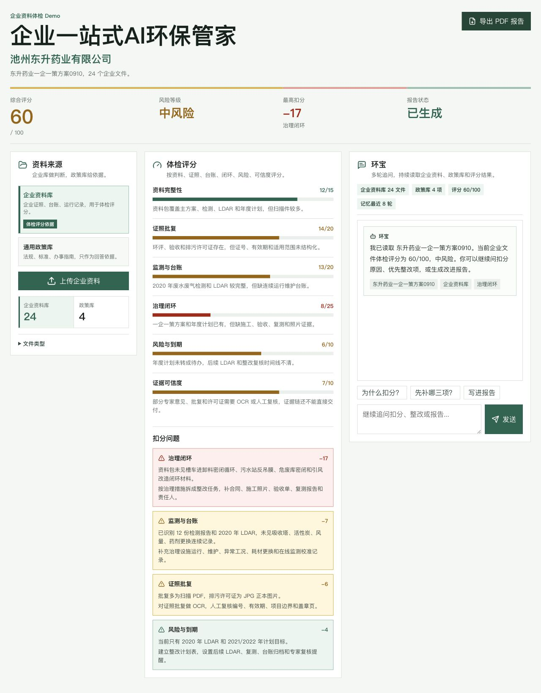
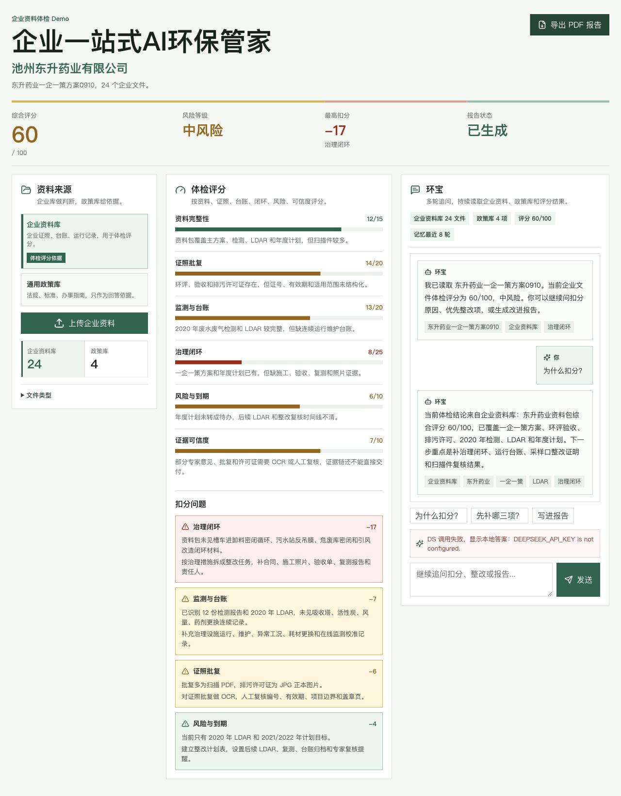
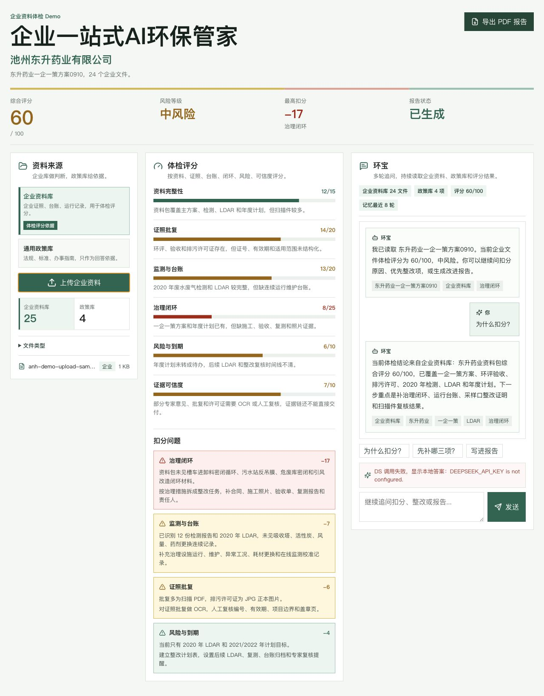
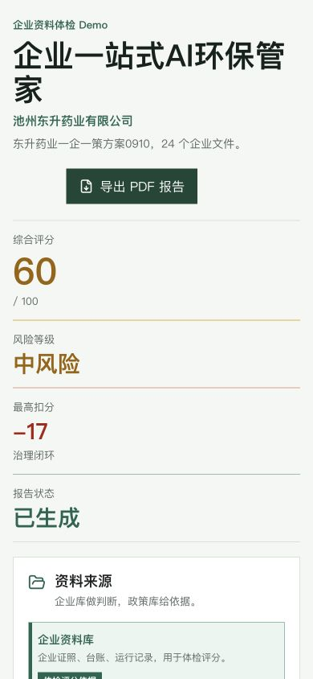
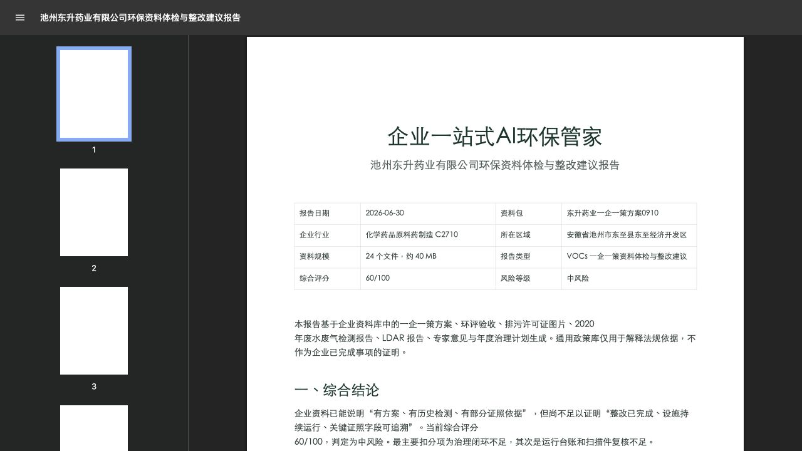

# 安环项目接管基线

版本：v0.3（已加入 Local Fixture 接管边界）  
日期：2026-08-04  
旧 Demo：`/Users/lichenhao/Desktop/环境demo`  
新项目目录：`/Users/lichenhao/Desktop/安环项目`

## 当前结论

状态标签：`VERIFIED_HACKATHON_PROTOTYPE`，不是生产系统。

旧 Demo 已具备完整的演示叙事：企业资料来源、体检评分、扣分问题、AI 问答和 PDF 报告。但评分、风险和整改建议是前端固定数据；上传仅记录文件名、大小和资料库分类；AI 只在 Vite 开发服务器中有代理；PDF 是预生成静态文件。

可以复用：现有视觉语言、信息层级、企业库/政策库边界、报告表达方式。  
需要重建：真实上传与存储、OCR/解析、页码级证据、规则与版本、专家复核、整改闭环、正式后端、权限、审计、报告生成和测试。

旧 Demo 的程序和固定结论仍不能直接升级为生产系统，但其中的原始资料包可以单独接管为 `LOCAL_FIXTURE`。用户已在 2026-08-04 明确同意将其用于本项目测试；该授权按本机/隔离环境开发与评估处理，不自动包含外部模型、公开展示、再分发、客户 UAT 或生产使用。

已登记的核心资料为 `东升药业一企一策方案0910`：24 个文件、41,500,435 bytes，其中 20 个 PDF/213 页，另有 2 个 DOC、1 个 DOCX、1 个 JPG。原件继续只读保留在旧目录，新项目只保存可复核哈希和使用规则；clean checkout 的统一说明见[本地 Fixture 使用边界](./LOCAL_FIXTURE_BOUNDARY.md)。

初始接管时，旧目录中没有找到 2026-08-01 之后的会议纪要、需求单或产品范围文档。后续口述需求现已进入新项目的产品定义、技术蓝图和统一决策台账；旧 Demo 的会前假设仍不作为需求真相。

## 运行验证

- `npm ci --offline`：通过。
- TypeScript 构建：通过。
- `npm run build`：通过。
- 开发态 `/api/chat`：普通 JSON 与 SSE 流式链路通过本地假上游验证。
- 生产预览 `/api/chat`：`404`，生产聊天链路不可用。
- 自动化测试：不存在 `test` 脚本。
- 未调用真实 DeepSeek，也未验证真实模型参数兼容性。

## 产品体验审计

### Step 1：打开企业体检总览 — Demo 健康，生产可信度不足

优点：产品目的清楚；企业资料库与政策库的边界可读；评分、风险和扣分问题层级明确。  
风险：进入页面即显示固定企业、固定 `60/100` 和“已生成”，没有项目选择、分析批次、数据版本或更新时间，容易把样例结论误认成真实结果。

### Step 2：追问扣分原因 — 可演示，失败状态不安全

远程 AI 不可用时，页面仍输出固定模板答案，只在下方显示错误。这会让用户误以为系统已基于资料完成分析。正式版必须失败关闭：明确进入重试或人工处理，不能用模板答案伪装成功。

### Step 3：上传补充资料 — 流程表面可用，业务链路未实现

测试文件上传后，企业资料数量从 24 变成 25，但评分、发现和报告均未变化。正式版需要显示上传、校验、解析、OCR、人工复核与分析的独立状态，并让结果绑定到对应分析批次。

### Step 4：移动端查看 — 能重排，不适合完成核心工作

390px 宽度下没有明显横向溢出，核心数字仍可读。但单页内容过长，上传、评分、扣分和问答串成一条长页面。首期应把移动端定位为查看和审批；资料分析、证据复核与报告编辑以桌面工作台为主。

### Step 5：打开 PDF 报告 — 可读，但不是当前数据生成物

报告封面与正文可读，也有人工复核边界提示；但文件是静态样例，与本次上传和分析状态无关。正式版必须由冻结的数据版本和已复核发现项生成，保留版本号、生成时间、规则版本和审计记录。

### 可访问性风险

- 已确认的优点：存在标题层级、体检总览区域标签、问答 `aria-live`、输入框标签，主要按钮高度基本可用。
- 可见风险：文本区移除了默认 `outline` 且没有等价焦点样式；隐藏文件输入仍暴露为第二个“Choose File”动作；部分 12–13px 辅助文本较小；风险色需要继续配合文本和图标表达。
- 本轮没有完成屏幕阅读器、完整键盘顺序、缩放 200% 和自动对比度测试，因此不能声称符合 WCAG。

## 首个可验收版本建议

建议把第一条纵向切片限定为：一个环保服务商、一个邀请制试点客户、一个厂区、一个地区与行业、一个明确资料体检流程。该切片验收通过后，再扩到建议的 3–5 家试点队列；“1 家切片”和“3–5 家试点总队列”不是两个互斥口径。

必须跑通：

1. 获得授权的真实或脱敏资料上传、持久化、文件哈希与项目隔离。
2. OCR/解析关键字段，显示置信度；失败明确进入人工处理。
3. 检查过期、缺项、签章缺失、算术错误与跨文档矛盾。
4. 每条发现绑定原文件、页码或图片区域、原文片段与规则版本。
5. 专家执行“通过 / 驳回 / 无法判断”，并保留修改记录。
6. 发现项转为责任人、期限、补件和重新复核的整改任务。
7. 使用冻结的数据版本和已复核结论生成可重复的版本化报告。
8. 具备邀请制登录、最小角色权限、操作审计、备份和明确失败状态。
9. 以盲测资料对比原人工流程，验收抽取质量、严重误报、引用覆盖、专家修改率和节省人时。

首版明确排除：全国全行业、完整 EHS、自动政府申报或换证、在线监测集成、无专家复核的正式合规结论、公开 SaaS 与复杂计费。

## 开工前必须从新谈话中确认

唯一更新入口为：[开工前决策与待确认事项](./开工前决策与待确认事项_2026-08-04.md)。

其中首个真实场景、真实人工流程、真实试点资料与 Acceptance Gold 授权、专业责任、部署/外部处理、资产归属、一期验收终点及预算运维属于 P0。P0 未全部确认前可以用已登记的 `LOCAL_FIXTURE` 搭通用工程骨架和内部回归，但不能把它迁移到 UAT/生产、发送给外部服务、冻结供应商/专业 Schema，或把旧固定评分继续包装成业务功能。
